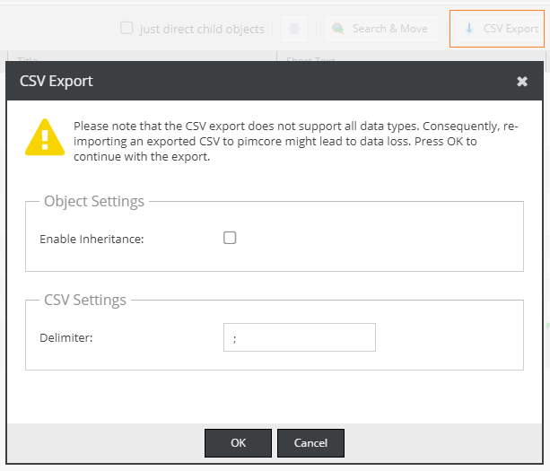
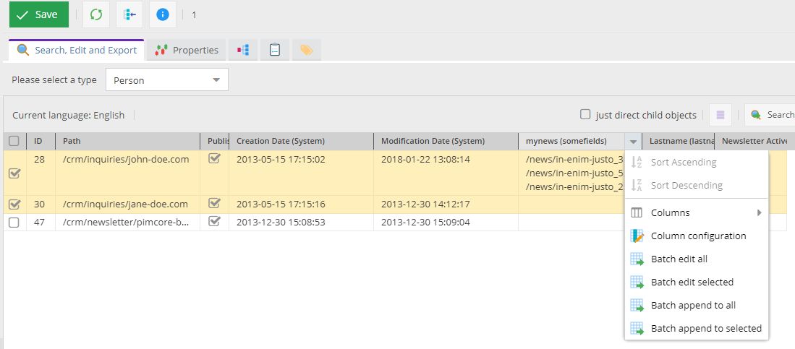

# Grid Configuration & CSV Export

You can use the object grid configurator button to adapt the grid to your needs,
i.e. add additional columns, change the column order or column width.
The chosen column configuration will also be applied for the CSV Export.

For experienced users there is an option to assemble custom columns using special operators as described in detail in 
* [Grid Configuration Operators](./02_Grid_Configuration_Operators.md)

## Saving & Sharing

You can define a favourite config for each object folder and share it with your friends.
As an admin user you can also share the config globally (i.e. without having to pick certain users).

Note that the shared config will always be owned by you. If you delete it then it will be also gone for all
users you shared it with. If you are not the owner of a view you want to share you have to copy it first.

Sharing can be accomplished via the `Save & Share' tab in the configurator window.

## Favourites

You can define a preferred config on folder level. If there is another object with a different setting you will have the option
to apply the setting to all folders or just leave it as it is.

## CSV Export Settings

By default, [Inheritance](../../Development_Documentation/05_Objects/01_Object_Classes/05_Class_Settings/25_Inheritance.md) will be disabled.
If you want to enable it or adjust CSV settings do this via the settings dialog.

## Batch Editing

You modify several objects at once by using the grid's batch update feature. There several modes:

* _Batch edit all_:  Overwrite the field's data for all objects that match the current grid filter (not only the visible ones!)
* _Batch edit selected_: Same but only for the selected ones
* _Batch append to all_: Same as batch edit all but the data will be appended. Currently only supported for relational types.
* _Batch append to selected_: Same as "batch append" but only applied to the selected ones. 

