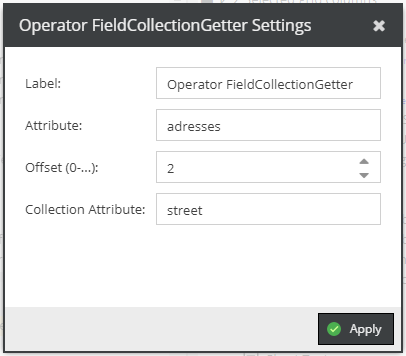

# FieldCollection Getter

Get a specific field of a field collection. 

This operator doesn't allow any children, all the configuration takes place directly in the 
configuration settings.
If item(s) or attributes do not exist, it returns an empty value. 

Configuration Settings: 
- Label: Label of column.
- Attribute: Name of the field collection attribute in data object.  
- Offset: Offset of the field collection item. 
- Collection Attribute: Attribute of the collection that should be fetched. 
 

