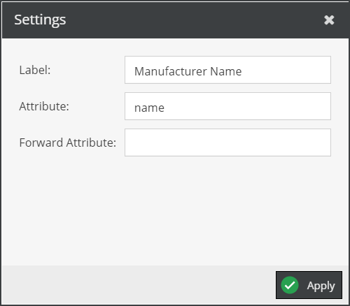
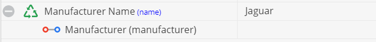

# ObjectField Getter

 
Get a specific field of an object.

Additional aspects: 
- If operator has no child element assigned, operator tries to call `get<Attribute>` on the current object. 
- If child of operator returns a `Concrete` object (e.g. a many-to-one relation attribute), 
  operator calls `get<Attribute>` on this object. 
- If child of operator returns a list of `Concrete` objects (e.g. many-to-many-object relation attribute), 
  operator calls `get<Attribute>` on all objects and returns an array of the values.
- With the `Forward Attribute` setting, the default principle for getting the data attribute value can be 
  changed. Instead of getting the data attribute value of the main data object, a set `Forward Attribute`
  results in calling `get<Forward Attribute>` on the current data object first and then the actual data 
  attribute value is calculated on its result. Thus, his would result in something similar to 
  `$object->get<Forward Attribute>()->get<Child Element>()->get<Attribute>()`. 
   

 
 
 

