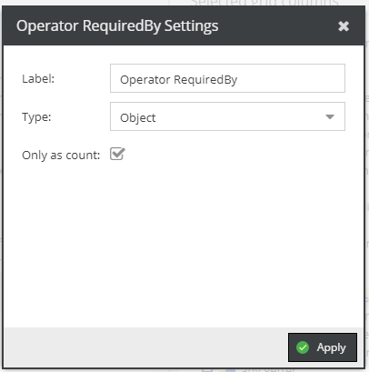

# Required By

Reads all `required by` dependencies of the data object and either returns the elements as array 
or the count of all dependencies. 

This operator accepts no child elements. 

Configuration Settings: 
- Label: Label of column.
- Type: Type of required by dependencies.
- Only as count: Just return count of dependencies.

