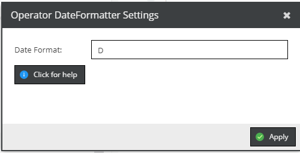

# Date Formatter

Formats the child value as a date based on defined [format](https://www.php.net/manual/en/datetime.format.php) 
with following rules: 
- If child value is an integer, it is interpreted as timestamp. 
- If child value is instance of `Carbon` date, its timestamp is used. 
- If child value is any other value (e.g. string), no formatting takes place and the child value is 
  returned without any formatting.  
- If not format is defined and child value is instance of `Carbon` date, `toDateString` function is used. 
  If child value is any other value and not format is defined, child value is returned without any
  formatting.   
 

In the following example you would get a textual representation of a day in three letters.

