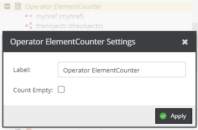

# ElementCounter

 
 
Counts all child elements.

 * Count Empty (see example below): Let us assume that `myhref` is empty and `theobjects` contains three elements.
 With `Count Empty` set to true the result would be 4 because the empty `myhref` is relevant for the result, otherwise it would be 3. 
 
 

