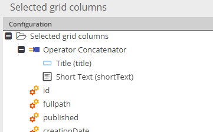

# Concatenator

Interprets children as string and concatenates them with defined glue to a combined string value. 
Uses PHP's `implode` function internally.  

Configuration Settings: 
 - Label: Label of column
 - Glue: Character(s) that should be used for concatenating the child values
 - Force Value: If set, always a value is returned (empty string if no child values). If not set, a 
 empty result is retuned if no child values are available. Might be relevant if operator result is
 used in further operators.  

Example: Concatenates price with static text `EUR`.

 