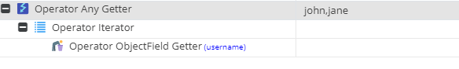

# Iterator

Expects the passed in value to be an array (of elements).

It can be used in combination of the [AnyGetter](../Extractors/AnyGetter.md) operator and forward attribute 
to further evaluate Multi-to-Multi relations.

