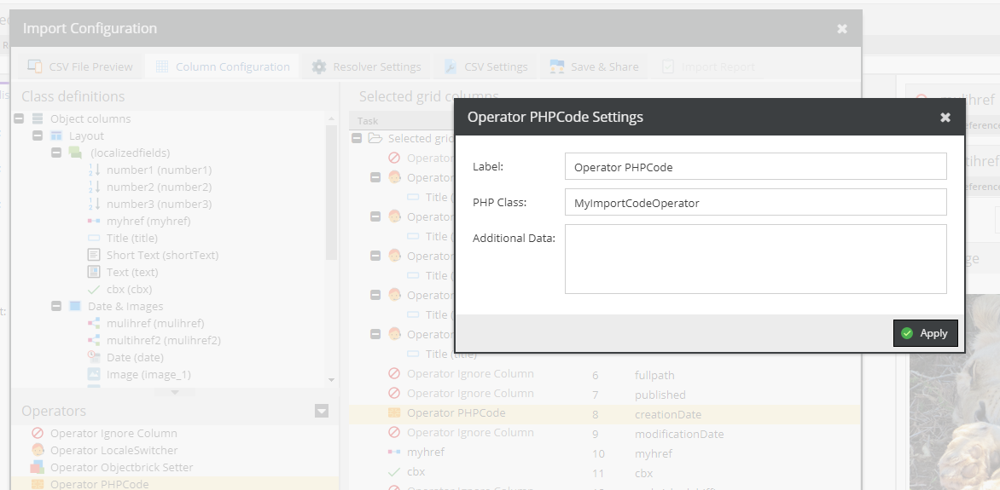
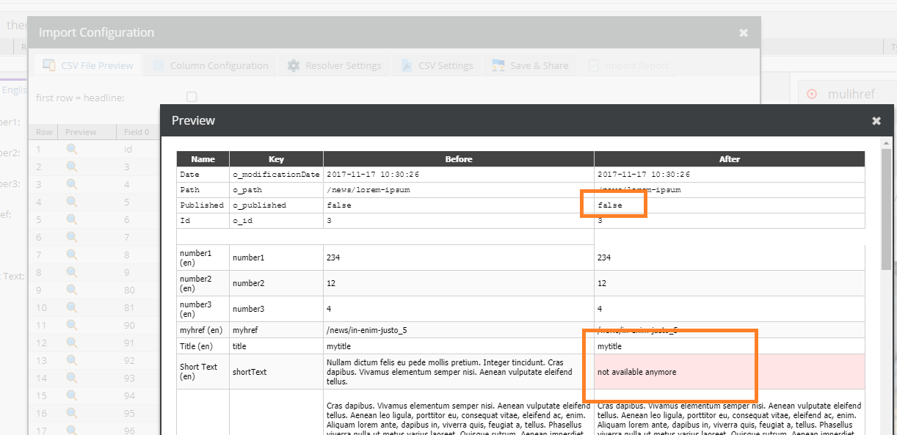

# Operator PHPCode


Allows you to provide a custom setter implementation.



Sample implementation: Unpublishes the object if the creation date was before 2017-11-17 which is CSV column 8 in this example.
In addition,it replaces the short text.

```php
<?php

use Pimcore\DataObject\Import\ColumnConfig\Operator\AbstractOperator;

class MyImportCodeOperator extends AbstractOperator
{
    private $additionalData;

    public function __construct(\stdClass $config, $context = null)
    {
        parent::__construct($config, $context);

        $this->additionalData = $config->additionalData;
    }

    public function process($element, &$target, array &$rowData, $colIndex, array &$context = [])
    {
        $colData = $rowData[$colIndex];

        $target->setPublished($colData > 1510931949);
        if (!$target->getPublished()) {
            $target->setShortText("not available anymore " . $this->additionalData, "en");
        }
    }
}
```



