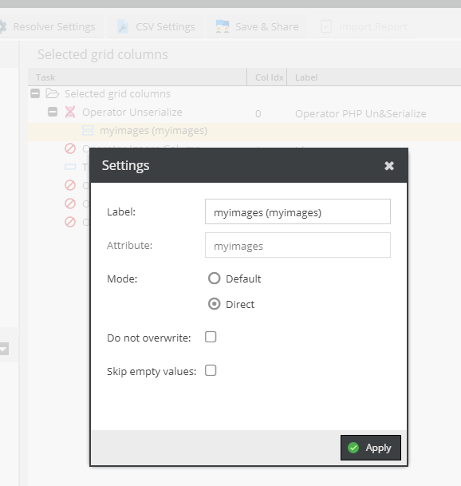

# Operator Unserialize

Applies the unserialized data to its child element.
In this example we unserialize a serialized fieldcollection.
Note that you should probably use the `direct` setter as the unserialized value is already in the format we need.

## Example

Configuration:

