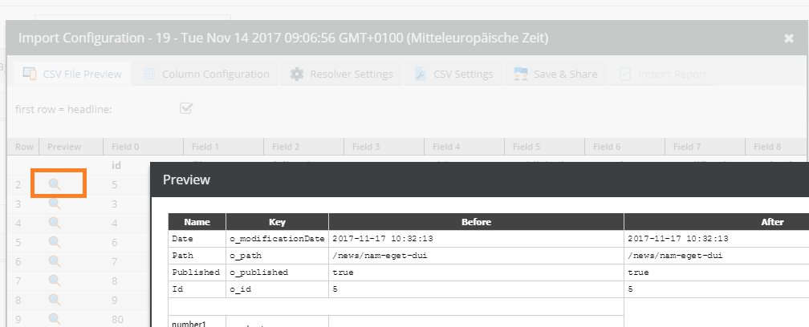
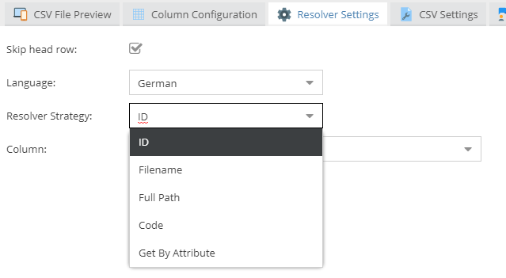
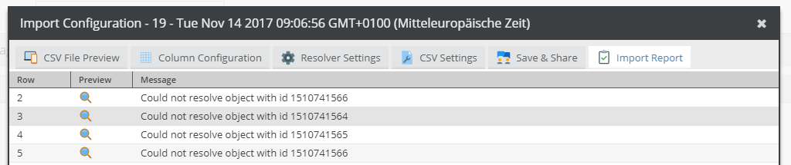

# CSV Import (Experimental)

> This is an experimental feature and subject to change without notice.

## General

The CSV import tool allows to you create & update existing objects from a CSV file. Various settings can be made regarding how existing objects are 
matched and how CSV columns are applied.

## Preview

The CSV preview grid shows the first 20 CSV rows. Click the `Search` icon to verify your settings and to see a preview of the changes that would happen.



## Column Configuration

The column configuration defines how CSV columns are mapped to object properties.

Operators can be used to change the way how the data is processed. See [Operator Overview](./02_Operators/README.md)

## Resolver Settings

Objects can be looked up in different ways. Your CSV export might have a `filename` column so you decide to match via the filename.
There are different resolver strategies available. The simplest one is the `ID` strategy which expects that a column value matches exactly with a object ID.
In some cases you might want to implement your own strategy. The [Code Resolver](./01_Resolver/05_Code.md) allows you to do this.




## CSV Settings

Give a short overview about the auto-detected CSV dialect.

## Save & Share

Allows you to describe your configuration. A configuration can be saved and reused at a later time.
Moreover, a saved configuration can be shared with other users or roles. For admins it is also possible to share the configuration globally.
Note that you will still be owner.

## Load Configuration

Load a saved configuration.

## Import Export Configuration

Load a export configuration and create a rudimentary import configuration. Please note that a complete import configuration cannot be automatically generated on the fly.
But there are at least certain basic options that can be automatically set.   

## Import Report

Lists all errors.



## Events

You can use the events described in the 
[Events](https://github.com/pimcore/pimcore/blob/master/pimcore/lib/Pimcore/Event/DataObjectImportEvents.php)
section to hook into the import process.

If you want to open the import window programmatically, use the following code:

```javascript
            var dialog = new pimcore.object.helpers.import.configDialog({
                classId: 2,                         // the class id
                mode: "direct",                     // instructs the importer not to ask for the file
                importConfigId: 19,                 // the saved configuration id
                parentId: 63,                       // the tree parent id (optional)
                uniqueImportId: "news",             // the unique id of this import (IMPORTANT: CSV is expected to be available at ' PIMCORE_SYSTEM_TEMP_DIRECTORY + '/import_' + [uniqueImportId])
                additionalData: {                   // optional data passed to the event handler
                    something: "everything"
                }
            });
```
