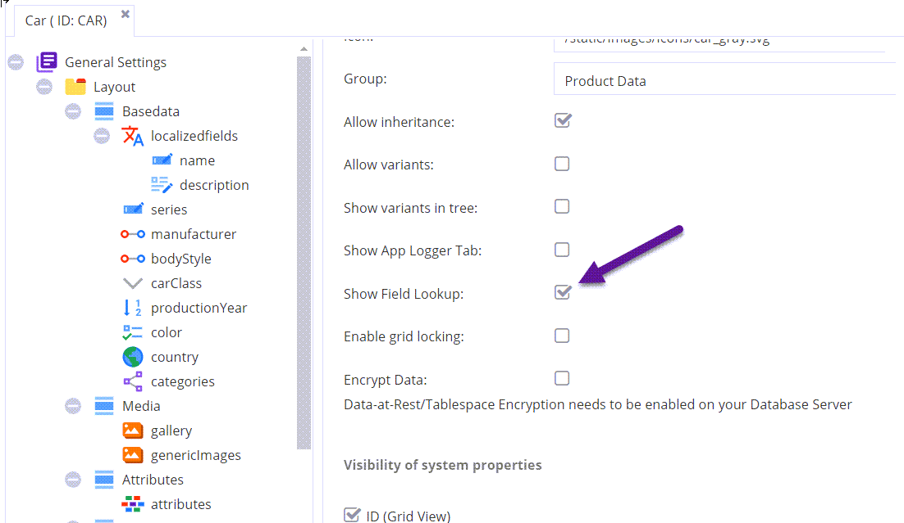
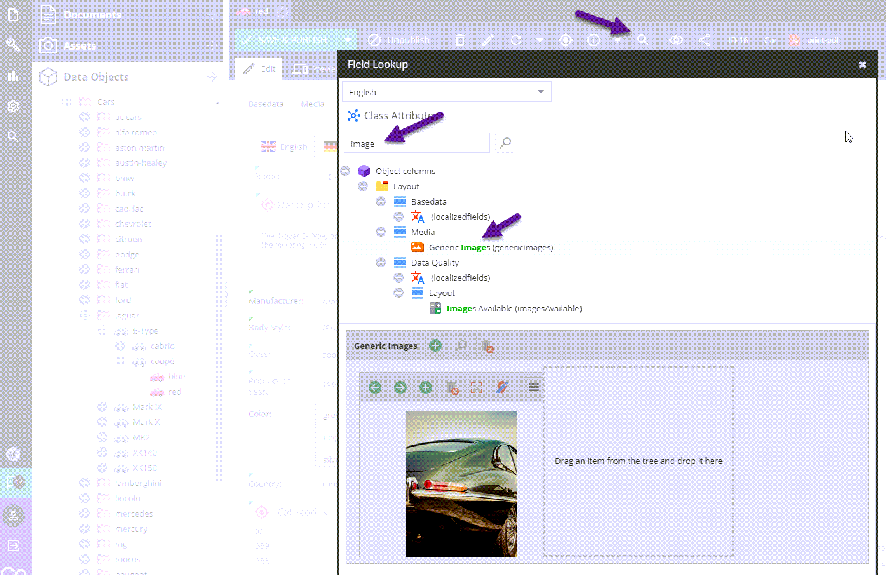

# Field Lookup

If you have very complex layouts, it is sometimes hard to locate the field you are looking for.

Use the `Field Lookup` functionality to filter down the layout tree.

> Note that you have to enable this in the class definition.

