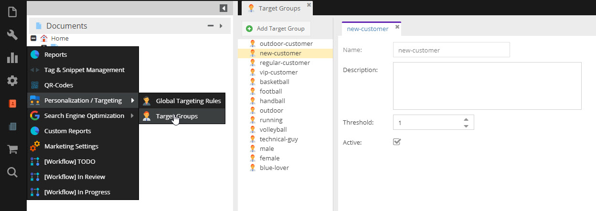
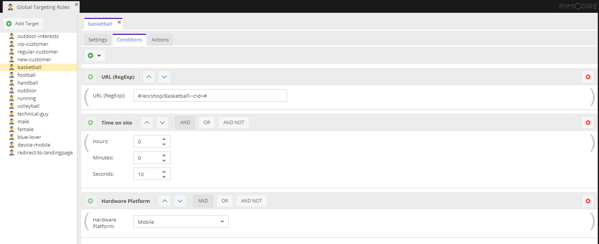
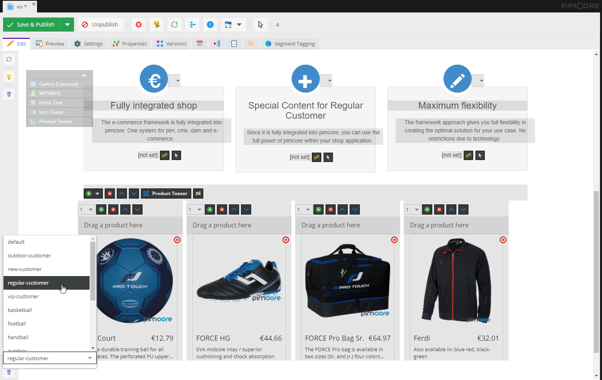

# Pimcore Concepts for Personalization

The following core concepts are the essential parts of Pimcores personalization engine.  
 
## Target Group

It is recommended to group your visitors into target groups. They help you to keep track and have an overview about what
content you need to provide and about which content is delivered to what visitor.

So, a *Target Group* is an entity which is used to personalize content for. 

Target groups are defined centrally, have an unique name and can have a description. 

See [Define Target Groups](./03_How_to_Personalize_Content/01_Define_Target_Groups.md) for further information. 

## Global Targeting Rule

*Global Targeting Rules* define the rule set based on which visitor profiling and content personalization takes place.
Thus they allow to assign target groups, redirect the visitor to certain pages or inject code snippets (special 
java scripts, etc.) to the response based on behavioral conditions.

Available conditions are Browser, Country, GeoPoint, Device, Language, Operating System, Referring Site, Search Engine, 
Target Group, Time On Site, URL and Visited Pages Before. They can be combined with boolean operators (AND, OR, NOT) and
brackets to archive complex conditions.  

Each targeting rule has name, may have a description and a scope: 
* **Hit**: Actions are executed on every request. 
* **Session**: Actions are executed once a session. 
* **Session (with variables)**: Actions are executed once a session and when visitor information changes, e.g. every time
when assigned target groups of current visitor change.   
* **Visitor**: Actions are executed once per visitor. 

The session expiry depends on the used storage engine. In default configuration the session expires when browser is 
closed. See [Dev Docs](../../Development_Documentation/18_Tools_and_Features/37_Targeting_and_Personalization/09_Targeting_Storage.md) for details.  

The visitor is identified via a browser cookie (named `_pc_vis`). As long as this cookie is available, a visitor is identified as unique.

See [Visitor Profiling](./03_How_to_Personalize_Content/03_Visitor_Profiling.md) and
 [Create Personalized Content](./03_How_to_Personalize_Content/05_Create_Personalized_Content.md) for further information. 

## Personalized Document Content

Pimcore Documents provide the possibility to create varying content variants for each defined target group. Once a target 
group is selected, all content elements within the document can be overwritten and personalized. For not overwritten 
content elements, the content is inherited from the default variant of the document.  

When delivering content to the visitor, the best matching variant is picked by Pimcore. *Best matching* is in this case 
is the variant of the target group with highest assignment count of the current visitor that has content set.   

See [Create Personalized Content](./03_How_to_Personalize_Content/05_Create_Personalized_Content.md) and
[Deliver Personalized Content](./03_How_to_Personalize_Content/07_Deliver_Personalized_Content_and_Debug.md)
for further information. 
