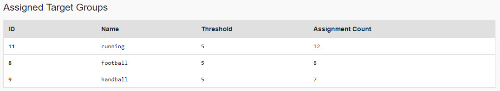
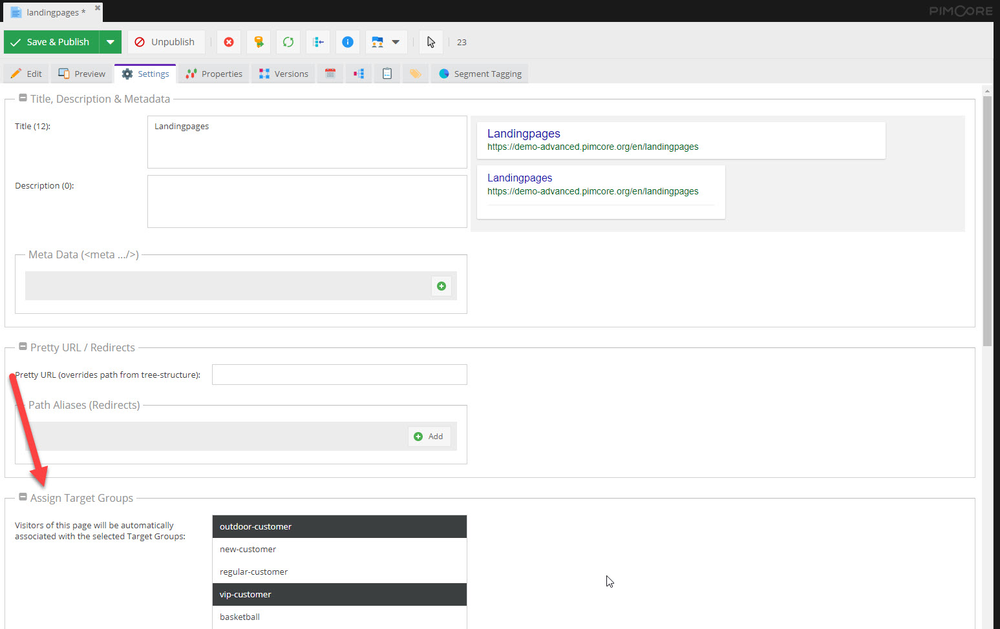
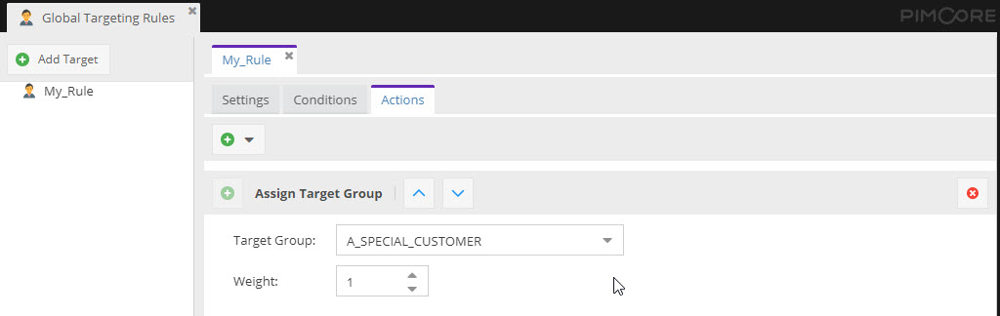

# Visitor Profiling

Visitor profiling is the process of getting to know visitors and assign one or multiple target groups based on their 
behaviour. 

The result of the ongoing profiling process is a set of target groups, that are assigned with a certain assignment 
relevance to the current visitor.

Pimcore provides two ways for profiling visitors based on their behavior. 

### Associate Target Groups directly with Pimcore Documents

It is possible to associate Pimcore documents directly with target groups. This can be configured in `Settings` tab of 
each document as soon as there are target groups defined in in the system. 

Once one or more target groups are associated with a document, the selected target groups are assigned to the visitor 
and the assignment count is increased by one, each time this document opened by the user.

### Use Global Targeting Rules to Assign Target Groups

*Global Targeting Rules* define a rule set based on which visitors can be profiled. Multiple conditions can be combined 
to complex criteria for assigning target groups to the current visitor based on their behavior. 
 

When assigning a target group via global targeting rules, also a assignment weight can be specified. This increases the 
assignment count of the target group respectively. 

For more fine-grained profiling possibilities see our [Customer Management Framework](https://github.com/pimcore/customer-data-framework/blob/master/README.md)
with its [Customer Segment functionality](https://github.com/pimcore/customer-data-framework/blob/master/doc/11_CustomerSegments.md)
and its [extensions to the Pimcore targeting engine](https://github.com/pimcore/customer-data-framework/blob/master/doc/30_Personalization.md).  
