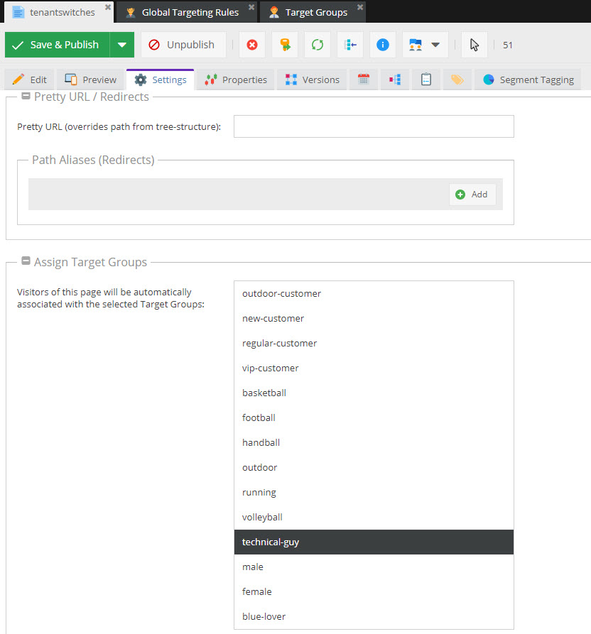
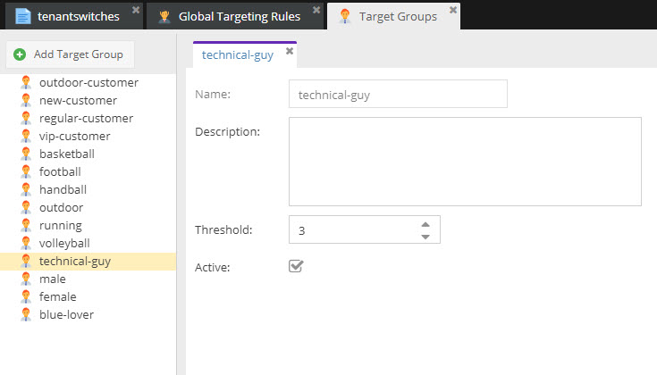
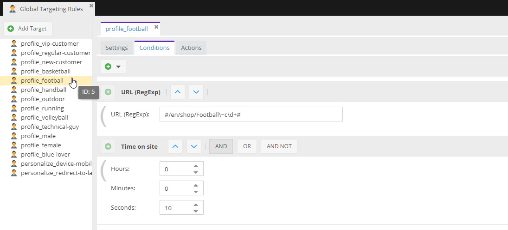
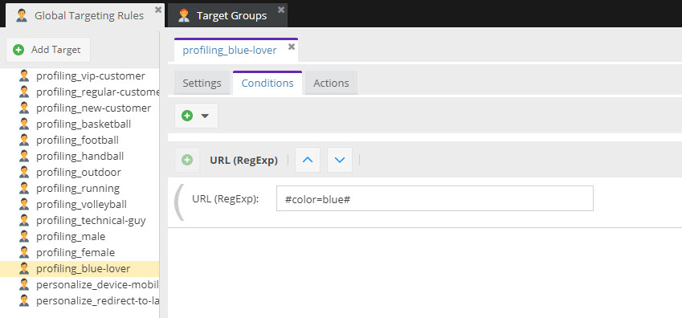
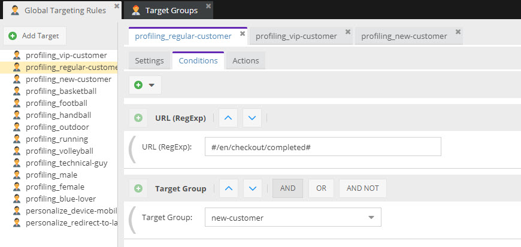
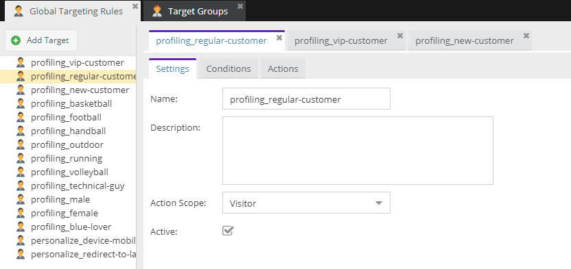
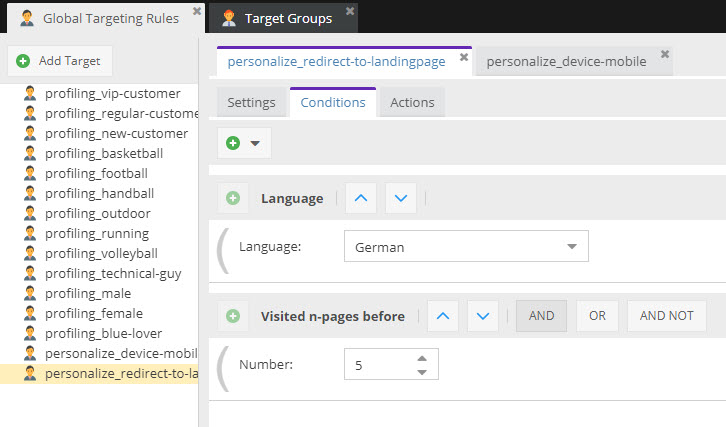
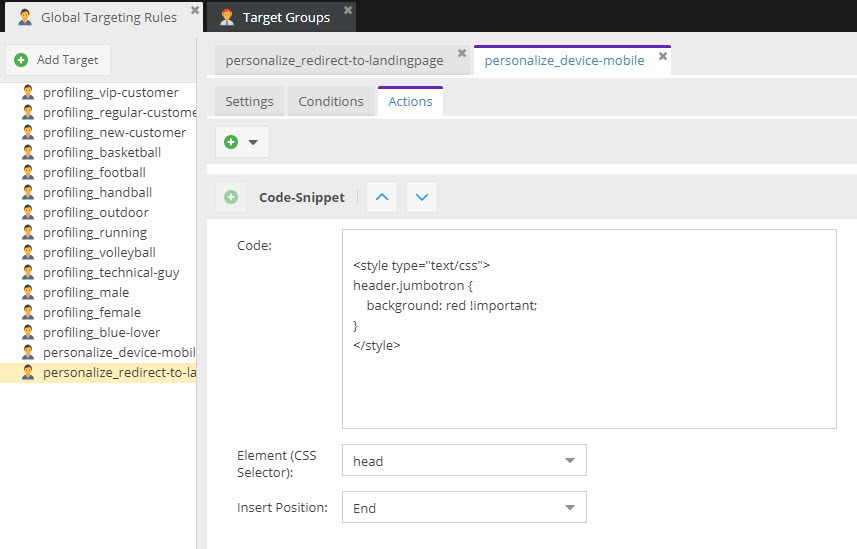
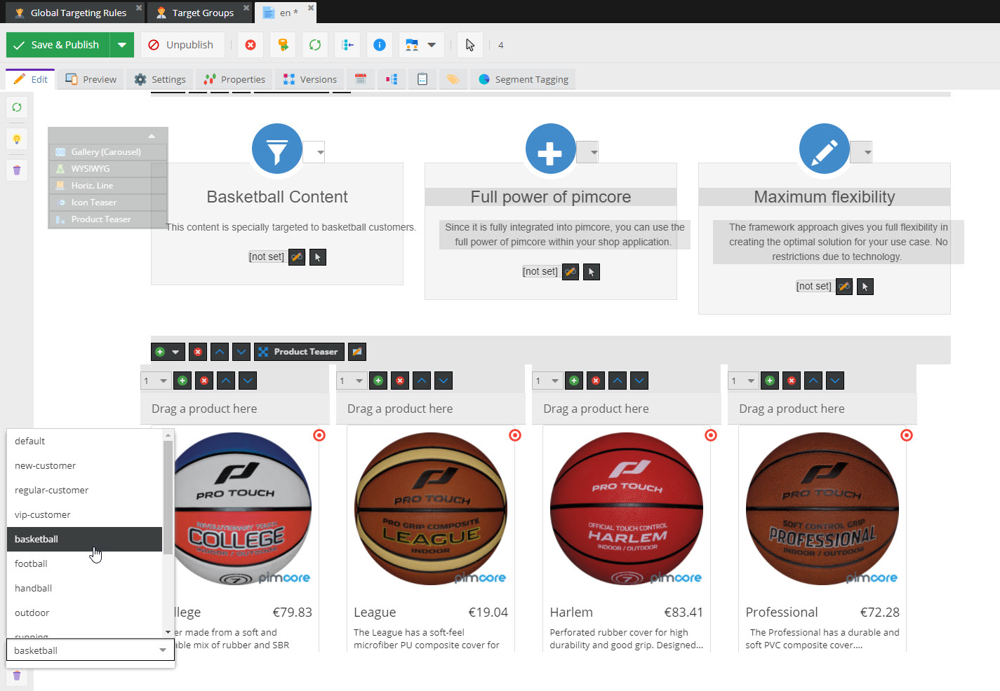

# Examples for Personalization and Targeting

The following pages show a few examples to better understand how things can be archived with the Pimcore targeting 
engine. 

All mentioned rules here are configured and set up in our [demo](https://demo.pimcore.fun) and can be 
tested there. 

## Visitor Profiling

The result of the ongoing profiling process is a set of target groups, that are assigned with a certain assignment 
relevance to the current visitor. So visitor profiling rules are always some conditions that result in assignment of 
an target group.  

### Learning about customer interests based on behaviour

##### Assign Target Groups to Documents
If there is a document, directly associate this document with a target group.

Every time a visitor visits that page, it gets the `technical-guy` target group assigned. Since one visit might be a 
coincidence, multiple visits might hint for a technical interest of that visitor. 
To filter out the coincidence visitors, a threshold can be defined at the target group. So not before the third visit, 
the target group is actually assigned to the visitors profile. 

  
For a real-life example please have a look at our [public demo instance](https://demo.pimcore.fun/en/More-Stuff/Demo-Features/Personalization).
 
##### Global Targeting Rules with simple Conditions & Actions

Regular visits in a certain shopping category (e.g. football) indicate an interest in football. To track that information,
add a global targeting rule with a URL condition and an action to assign the corresponding target group. 

To eliminate coincidence visits, e.g. an additional `time on site` condition can be added, like at the `profiling_football` 
targeting rule at the demo.

 

The action should be executed on every request that matches the criteria - so use the scope `Hit` here. By doing so, 
the assignment count of the target group gets increased every time and so a certain relevance for the target groups 
can be identified - e.g. visitor is more interested in football that in basketball.

### Guessing customer characteristics based on behaviour

##### Global Targeting Rule with more complex Conditions

Similar to the category interest tracking, customer characteristics like favorite color or even gender can be guessed. 
To do so, add for example a targeting rule that tracks product filtering for blue products and assigns corresponding 
target groups like the `profiling_blue-lover` rule does in the demo. 

 

### Classify customers based on behaviour

##### Identify regular customers

In addition to collecting customer characteristics, you also could classify customers based on number of orders they made. 
For example once a new customer creates an additional order, it becomes a regular customer. See the `profiling_regular-customer`
rule in the demo for details. 

 

In this case, it is important that the action is executed only once. Therefore choose `Visitor` as scope. 

 

These are only a few simple examples for visitor profiling with Pimcores targeting engine.

## Personalize Content

### Personalize content using global targeting rules

##### Redirect visitor to a certain landing page

One example for content personalization is to redirect a visitor to a special landing page that is answering this questions. 
In our demo the example `personalize_redirect-to-landingpage` redirects visitors with language german that visited 5 pages
on our website to a landing page. 

 

Of course this should happen not after every hit but only once per session, so scope is set to `session`. 

##### Inject special content to mobile visitors

Another use case could be, that special users (e.g. mobile users from a certain country) should see a slightly different
layout. See the `personalize_device-mobile` rule of our demo how this can be archived by injecting additional CSS code 
to the page. 

 
 

### Personalized content documents

The most common and most flexible way to customize content is to create customized variants of documents for certain
target groups. See [Create Personalized Content](../03_How_to_Personalize_Content/05_Create_Personalized_Content.md) 
and [Deliver Personalized Content](../03_How_to_Personalize_Content/07_Deliver_Personalized_Content_and_Debug.md) for
details. 
 
In our demo several different variants of the portal page are set up - e.g. for target groups `football`, `basketball`,
`handball` and others. 
Just try archive the corresponding target groups and see what happens. 

 
 