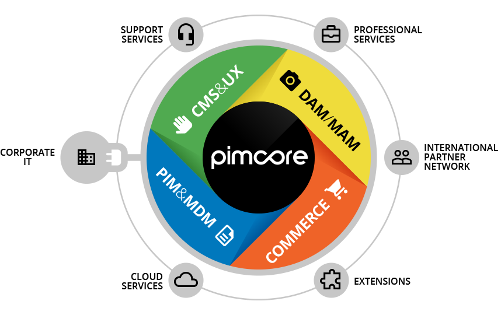

# Pimcore overview
Pimcore is the leading open source platform for managing digital data and a fully integrated software stack for CMS, DAM, PIM 
and Commerce. 

As a platform pimcore provides a solid foundation with generic functionality for all kinds of web applications and therefore 
allows rapid application development and building customer solutions really fast. 

Its API driven approach makes it easy to develop with pimcore, allows integration into every IT infrastructure and makes it 
easily extendable. Even headless execution of Pimcore is possible. 

Pimcore is built for developers and should empower them to build great digital experiences easily. As a consequence Pimcore 
is NOT an ‘out-of-the-box’ software product like Wordpress, Magento, Oxid and others. You need a developer to get started. 

# Pimcore in a nutshell
Our mission is to provide ONE platform for ANY data, ANY channel, ANY process and ANY one. 

## ANY data 
In Pimcore every digital content can be managed and put in relation with each other. To do so, there are three main element 
data types in pimcore:

### Assets
Assets are the DAM part of Pimcore. Within assets every digital file (images, videos, pdfs, …) can be stored and managed in 
a folder structure. Additionally, previews for many file types and editing functionality for some file types are available and 
assets can be enriched with meta data. 

### Documents
Documents are the CMS part of Pimcore and can be used to manage unstructured data. Based on a template, documents can contain 
any content and can be used to create webpages, print pages or any other output format. 

### Objects
Objects are the PIM part of Pimcore and are the way to go for managing structured data within pimcore. Based on a class 
definition that defines structure and attributes object can be used for pretty much any structured data – may it be products, 
categories, persons, customers, news, orders, blog entries, … For the attributes many datatypes (simple ones and really 
complex ones) are available.  

Most important, all elements (assets, documents or objects) can be linked with and set into relation with each other.

## ANY channel / ANY process
As Pimcore is a platform that stores data channel independent, it can provide the managed data to any channel – simple 
websites (B2B, B2C), commerce-systems (integrated, third party), print, digital signage, … There are basically no limits. 

In terms of output to the frontend, Pimcore follows the MVC pattern and is based on Zend Framework. 
 If you don't know the MVC pattern please read [this article](http://en.wikipedia.org/wiki/Model%E2%80%93view%E2%80%93controller) 
 first.
If you are new to the Zend Framework or the ZF MVC you can read about 
[controller](http://framework.zend.com/manual/1.12/en/zend.controller.html) in Zend Framework manual. With this 
knowledge learning Pimcore will be much easier.

In addition to that, Pimcore can also be executed in a headless way and therefore integrated into any environment. 

## ANY One 
Pimcore provides lots of functionality on top of its basic data elements that already cover lots of use cases. 
But being a platform, Pimcore can be used for pretty much any use case and easily extended if necessary. 

-----
Wanna see more - [Let's get started](../01_Getting_Started/00_Installation.md)

#### Also have a look at 
* [Pimcore ecosystem](./00_Pimcore_Ecosystem.md)
* [Develop for Pimcore](./01_Develop_for_Pimcore.md)