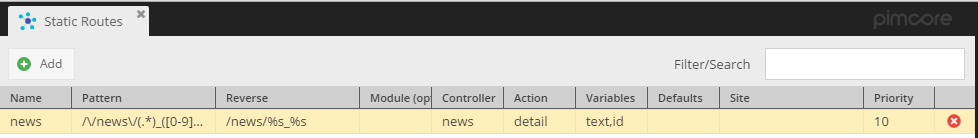

[TOC]

## General

Custom routes are used to define a URL-pattern for a specific action.
For example you have a newslist, which is generated out of a object list, and you want to give the news a detail page. 
Since objects are not reachable via the web and they have no template assigned, you can use the custom routes to create this.

[comment]: #TODOinlineimgs

<div class="inline-imgs">

Go to:  **Settings -> Static Routes**

</div>

The configuration fro a newslist coild look like below:

| Name     | Pattern                   | Reverse       | Module     | Controller     | Action     | Variables     | Defaults     | Site     | Priority     |
|----------|---------------------------|---------------|------------|----------------|------------|---------------|--------------|----------|--------------|
| news     | /\\/news\\/(.*)_([0-9]+)/ | /news/%s_%s   |            | news           | detail     | text,id       |              |          | 10           |

And, the grid preview:



In the pattern you can define a regex, and the column "Variables" you can specify comma-separated the keys of the placeholders in the pattern regex.

This is how you can access (form a controller action) the values of the variables (placeholders) you specified in the custom route:

```php
class NewsController extends Action
{
    public function detailAction()
    {
        $id = $this->getParam('id');
        $text = $this->getParam('text');
        
        ...
```

The default variables can be accessed also the same way.

## Create URL's out of Custom Routes

URL are generated using the default ```\Zend_View``` URL helper ```$this->url()```; 

You can define a placeholder in the reverse pattern with %THE_NAME and it's also possible to define an optional part, 
to do so just enbrace the part with curly braces { } (see example below).

| Name          | Pattern                                                  | Reverse                                          | Module     | Controller     | Action     | Variables                | Defaults     | Site     | Priority     |
|---------------|----------------------------------------------------------|--------------------------------------------------|------------|----------------|------------|--------------------------|--------------|----------|--------------|
| news category | /\\/news-category\\/([^_]+)_([0-9]+)(_category_)?([0-9]+)?/ | /news-category/%text_%id{_category_%category_id} |            | news           | list       | text,id,text2,categoryId |              |          | 1            |

Admin panel:


Due to optional parameters, the above example matches for the following URL's:

* /news-category/testcategory_12_category_2
* /news-category/testcategory_12

```php
class NewsController extends Action
{
     public function listAction()
    {
        $routeParams = [
            "text" => $this->getParam("text"),
            "id" => $this->getParam("id"),
            "text2" => $this->getParam("text2"),
            "categoryId" => $this->getParam("categoryId")
        ];
        ...
```

```
array (size=4)
  'text' => string 'testcategory' (length=12)
  'id' => string '12' (length=2)
  'text2' => string '_category_' (length=10)
  'categoryId' => string '2' (length=1)
```

## Examples

### Generating url with additional parameter

This snippet you can use in the view file:

```php
$this->url([
    'text' => 'Test',
    'id' => 67,
    'category_id' => 33,
    'getExample' => 'some value'
], 'news category');
```

Since there is no parameter available out of the route pattern you have to set every parameter + there is one parameter which is not in the reverse route, so that will be added as a normal GET parameter.

Output will be: ```/news-category/test_67_category_33?getExample=some+value```

### Adding default values to the route

You can use the **Defaults** column to add default values which will be used if you don't specify parameters in the url helper.

For example, I declared default values for **text** and **id** parameter, below:

|...|Defaults|...|
|-|-|-|
| ... | id=5\|text=random text | ... |


```php
$this->url([
    "category_id" => 776
], "news category");
```

The code above returns ```/news-category/random+text_5_category_776```

## Dynamic controller / action / module out of the route pattern

Since pimcore 1.4.2 pimcore supports dynamic values for the controller, action and the module. 

**NOTE:** This works only with named placeholders!

It works similar to the reverse route, you can place your placeholders directly into the controller.
The following configuration should explain the way how it works:

| Name                          | Pattern                                    | Reverse                    | Module             | Controller             | Action             | Variables             | Defaults             | Site             | Priority             |
|-------------------------------|--------------------------------------------|----------------------------|--------------------|------------------------|--------------------|-----------------------|----------------------|------------------|----------------------|
| articles-dynamic-prefix       | /\\/(events\|news)\\/(list\|detail)/       | /%con/%act                 |                    | %con                   | %act               | con,act               |                      |                  | 10                   |
| articles-dynamic-simple       | /\\/dyn_([a-z]+)\\/([a-z]+)/               | /dyn_%controller/%action   |                    | %controller            | %action            | controller,action     |                      |                  | 1                    |


In that case, you have few valid URL's:

```/news/detail``` - ```\NewsController::detailAction```

```/events/detail``` - ```\EventsController::detailAction```

```/news/list``` - ```\NewsController::listAction```

```/events/list``` - ```\EventsController::listAction```

And also, many urls without controller and action name limits. For example: ```/dyn_news/detail``` - ```\NewsController::detailAction```
 
## Advanced usage - Direct the Request to a plugin

In the grid for the custom routes is a **module** column. 
When this column is filled, Pimcore routes the request to a different module than the standard module (website module). 

Enter the name (=folder name) of the Plugin to which you want to route the request. Fill the other columns (route, controller, action ...) as always.

## Site support

It's possible to generate URL's pointing to a different site inside Pimcore. To do so set the option **site**. 
 

### Example: Linking to the site with the ID 3

```php

// using the Site object
echo $this->url([
    "id" => 4,
    "text" => "some-text",
    "site" => \Pimcore\Model\Site::getById(3)
], "news");


// using the ID
echo $this->url([
    "id" => 4,
    "text" => "some-text",
    "site" => 3
], "news");

// using one of the hostname assiged to the site
echo $this->url([
    "id" => 4,
    "text" => "some-text",
    "site" => "subsite.example.com"
], "news");

```

### Example: Linking back to the main-site

```php
echo $this->url([
    "id" => 4,
    "text" => "some-text",
    "site" => 0
], "news");

```

## Using URL helper for query string URL generation

Sometimes it is useful to generate a link with just a query string. 
You can do so by using **false** as the 2nd parameter (instead of a routes name). 

```php

$this->url(["foo" => "bar"], false);
// ==> /?foo=bar

```

## Responding 404 status code

Sometimes you want to trigger a correct 404 error within your controller/action (addressed by a custom route), for example when a requested object (in the route) doesn't exist anymore. 

This can be done anytime and anywhere in your code with:

```php
throw new \Zend_Controller_Router_Exception("the requested object doesn't exist anymore");
```

This code triggers the error handler which shows the error page with the correct 404 status code. 

Example:

```php
public function testAction() {
    $object = Object::getById($this->getParam("id")); 
    if( !$object || ( !$object->isPublished() && !$this->editmode && !$this->getParam('pimcore_object_preview') && !$_COOKIE['pimcore_admin_sid'] ) ) {
        throw new \Zend_Controller_Router_Exception("the requested object doesn't exist anymore");
    }
}
```