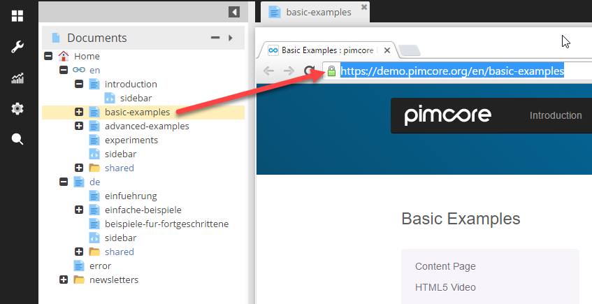

# URLs based on Documents and Pretty URLs
 
## Introduction

One essential routing option in Pimcore are the Pimcore Document paths. Along with Pretty URLs they define the address
of a Document in the Browser. 
The Document path and pretty URLs come third in the route processing priority.  
 
## Document Path
 Every document has a path (in the document tree) that directly represents the address in the browser 
  (e.g. https://demo.pimcore.org/en/basic-examples). When a visitor requests a page at a specific address, Pimcore 
  uses a custom route in the front controller that determines if there is a suitable document for the 
  requested address. 
  
  
  
  If there is a document path matching the requested path info, the route then uses the controller, action and view defined in the 
  document's settings, passing them to the dispatcher along with the document itself.
  See [Documents documentation](../../03_Documents/README.md) for more details for setting of Documents. 
  
 
## Pretty URL (Custom Slugs / Clean URL)
The Pretty URL setting overrides a documents full path only for the purpose of routing. 
This is useful for when you would like to create shorter paths or friendly URLs for sharing. A Pretty URL does 
not redirect to the original URL.

Pretty URLs can be defined in the Documents settings as shown in the screen below: 

  