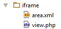

# Create Your Own Bricks

## Architecture of a Brick

You can put your bricks into `/website/views/areas`.
Two mandatory files for bricks are: `view.php` and `area.xml`. 
There are also three optional files" `action.php`, `edit.php`, `icon.png`.

If you put an icon.png (16x16 pixel) into the brick's folder, this icon is added automatically to the toolbar, 
there's no need to specify the icon in the area.xml again.
 
The following screenshot shows the standard architecture of a brick:  


The area.xml contains some meta-infos about the brick, 
and the view.php is a simple `\Zend_View` - script where you can use all [Pimcore editables](../README.md).

## How to Create a Brick
 
Let's suppose, that our brick is responsible for generating an `<iframe>` containing contents from a specified url in the editmode.

The directories structure in `website/views` looks like the following:  


First of all we need the area.xml file containing the meta-data: 
```xml
<?xml version="1.0"?>
<zend-config xmlns:zf="http://framework.zend.com/xml/zend-config-xml/1.0/">
    <id>iframe</id>
    <name>Iframe</name>
    <description>Embed contents from other URL (websites) via iframe</description>
    
    <!-- the following infos are optional -->
    <icon>/pimcore/static/img/icon/html.png</icon>
    <version>1.0</version>
    
    <!-- you can add your custom configurations as well -->
    <myCustomConfig>MyValue</myCustomConfig>
</zend-config>
```

After `area.xml` you have to create the view script, called `view.php`.

There is an info-object provided which contains information about the current brick. 
You can access this info-object within your view using `$this->brick`, the object contains the configuration from above (`\Zend_Config`) an some other metadata (described later).

The `view.php` file would look like, below.
```php
<?php if($this->editmode): ?>
    <?php
    // with $this->brick->getPath() you get the path of the area out of the info-object.
    ?>
    <link rel="stylesheet" type="text/css" href="<?= $this->brick->getPath(); ?>/editmode.css" />

    <div>
        <h2>IFrame</h2>
        <div>
            URL: <?= $this->input("iframe_url"); ?>
        </div>
        <br />
        <b>Advanced Configuration</b>
        <div>
            Width: <?= $this->numeric("iframe_width"); ?>px (default: 100%)
        </div>
        <div>
            Height: <?= $this->numeric("iframe_height"); ?>px (default: 400px)
        </div>
        <div>
            Transparent: <?= $this->checkbox("iframe_transparent"); ?> (default: false)
        </div>
    </div>
<?php else: ?>
    <?php if(!$this->input("iframe_url")->isEmpty()): ?>
    <?php
            // defaults
            $transparent = "false";
            $width = "100%";
            $height = "400";

            if(!$this->numeric("iframe_width")->isEmpty()) {
                $width = (string) $this->numeric("iframe_width");
            }
            if(!$this->numeric("iframe_height")->isEmpty()) {
                $height = (string) $this->numeric("iframe_height");
            }
            if($this->checkbox("iframe_transparent")->isChecked()) {
                $transparent = "true";
            }
        ?>
    <iframe src="<?= $this->input("iframe_url"); ?>" width="<?= $width; ?>" height="<?= $height; ?>" allowtransparency="<?= $transparent; ?>" frameborder="0" ></iframe>

    <?php endif; ?>
<?php endif; ?>
```

Now you should be able to see your brick in the list of available bricks on your areablock:


In editmode you can see the configuration for the Iframe brick:


## The Brick ***info-object***

As mentioned before, the info-object contains useful information about the current brick.
It is available as a common view variable (`$this->brick`) in your view scripts (`edit.php` and `view.php`).
 
All available methods in your view are listed below (both in edit.php and view.php):

| Method                      | Description                                                                                                        |
|-----------------------------|--------------------------------------------------------------------------------------------------------------------|
| `$this->brick->getId()`       | Returns the ID of the current brick                                                                                |
| `$this->brick->getConfig()`   | Returns the configuration (`\Zend_Config`) out of `area.xml` (to get your custom properties, ... )                 |
| `$this->brick->getIndex()`    | Returns the current index inside the areablock                                                                     |
| `$this->brick->getPath()`     | Returns the (web-)path to the current brick, this is useful for embedding external stylesheets, javascripts, ...    |

## Configuration in Editmode
You can use the `edit.php` file to allow users to add data to the brick. The `edit.php` file can include HTML and editables.
When this file is present an icon will appear for the user which can be clicked to display and edit the editable fields.

> Using `edit.php` will disable all editables in `view.php` in editmode (they appear like in the frontend, but cannot be edited). 

Example contents of the `edit.php` file:
```php
Class: <?= $this->input('class'); ?>
```

Accessing the data in the `view.php` file:
```php
<?php
    $class = '';
    if(!$this->input('class')->isEmpty()) {
        $class = $this->input('class')->getData();
    }
?>
```

## Actions for Bricks
Sometimes a brick is more than just a view-script and contains some functionality which shouldn't be directly in the view. 
In this case you can use the `action.php`. 

The `action.php` doesn't contain a "real" ZF-compatible controller/action it is just a little helper to get some logic and code out of the view, but the behavior is like in a common ZF-controller but with limited functionalities (no helpers, no dispatcher, ...).
 To use this feature simply create a new file called `action.php` in your brick directory and insert the following code:
 
```php
<?php

namespace Pimcore\Model\Document\Tag\Area;
use Pimcore\Model\Document;

/**
 * Class Iframe
 * @package Pimcore\Model\Document\Tag\Area
 */
class Iframe extends Document\Tag\Area\AbstractArea
{
    /**
     * reuired
    */
    public function action () {
        $myVar = $this->getParam("myParam");
        //...
        $this->view->myVar = $myVar;
    }

    // OPTINAL METHODS
    /**
     * optional 
     * Executed after a brick is rendered
     */
    public function postRenderAction(){
        //...
    }

    /**
     * optional 
     * Returns a custom html wrapper element (return an empty string if you don't want a wrapper element)
     */
    public function getBrickHtmlTagOpen($brick){
        return '<span class="customWrapperDiv">';
    }

    /**
     * optional 
     */
    public function getBrickHtmlTagClose($brick){
        return '</span>';
    }
}
```

The method `action` is called automatically before rendering the `view.php` or `edit.php`.
Ensure that your class extends `Pimcore\Model\Document\Tag\Area\AbstractArea`.

The method `postRenderAction` is called after a brick is rendered.

The methods `getBrickHtmlTagOpen` and `getBrickHtmlTagClose` allow you to use custom Brick wrappers (if the methods aren't specified - the regular "Pimcore-HTML-Brick-Wrappers" will be inserted).

You can access the `action.php` object in your views with `$this->actionObject`

Inside this class/object there are some general methods available (inherited from `Pimcore\Model\Document\Tag\Area\AbstractArea`) which offers you some handy features like the info-object (as described above), the config and much more... 
To see it in detail check out the contents of `Pimcore\Model\Document\Tag\Area\AbstractArea`, the methods are self-describing .

## Examples

You can find many examples in the [demo / quick start package](https://github.com/pimcore/pimcore/tree/master/website_demo/views/areas).
