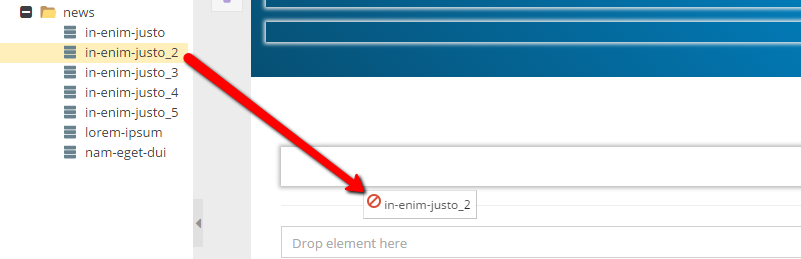

# Href Editable

## General

Href provides the functionality to create a reference to an other element in Pimcore (document, asset, object).
In frontend-mode the href returns the path of the linked element.

## Configuration

| Name         | Type    | Description                                                                                                                                |
|--------------|---------|--------------------------------------------------------------------------------------------------------------------------------------------|
| `types`      | array   | Allowed types (document, asset, object), if empty all types are allowed                                                                    |
| `subtypes`   | array   | Allowed subtypes grouped by type (folder, page, snippet, image, video, object, ...), if empty all subtypes are allowed (see example below) |
| `classes`    | array   | Allowed object class names, if empty all classes are allowed                                                                               |
| `reload`     | boolean | `true` triggers page reload on each change                                                                                                 |
| `width`      | int     | Width of the field in pixel.                                                                                                               |
| `uploadPath` | string  | Target path for (inline) uploaded assets                                                                                                   |
| `class`      | string  | A CSS class that is added to the surrounding container of this element in editmode                                                         |
| `tag`        | string  | A tag name that is used instead of the default `div` for the surrounding container of this element in editmode                             |

## Methods

| Name            | Return   | Description                                |
|-----------------|----------|--------------------------------------------|
| `getElement()`  | Element  | Get the assigned element                   |
| `getFullPath()` | string   | Get the full path of the assigned element. |
| `isEmpty()`     | boolean  | Whether the editable is empty or not       |

## Examples

### Basic usage

You can just create the code line like, below:

```php 
<?= $this->href("myHref"); ?>
```

After, the view in the administration panel changes like in the picture:


### Using Restriction

If you want specify elements which could be assigned to the href editable, use `types`, `subtypes` and `classes`
options in the editable configuration.

##### Example
 
```php
<?= $this->href("myHref", [
    "types" => ["asset","object"],
    "subtypes" => [
        "asset" => ["video","image"],
        "object" => ["object"]
     ],
    "classes" => ["person"],
]); ?>
```

We restricted the `myHref` editable to the following entities: 
* Video / Image (Assets) 
* Person Objects (`\Pimcore\Model\Object\Person`) (Objects) 
 
As you see in the picture below, it's impossible to drop any other type to that editable.



### Download Example

Another useful use-case for the href editable is a download link. 

```php
<?php if ($this->editmode): ?>
    <?= $this->href("myHref"); ?>
<?php else: ?>
    <?php if ($this->href("myHref")->getElement() instanceof Asset): ?>
        <a href="<?= $this->href("myHref")->getFullPath() ?>"><?= $this->translate("Download") ?></a>
    <?php endif; ?>
<?php endif; ?>
```
