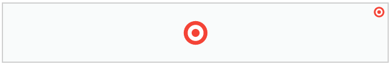
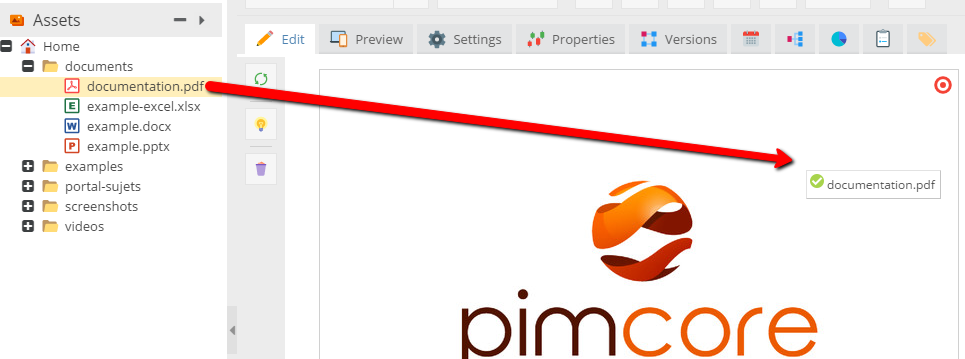
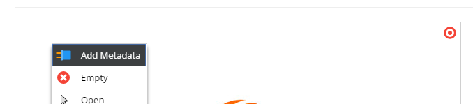

# PDF

> This editable requires Ghostscript installed on your server. 
> See [System Requirements](../../13_Installation_and_Upgrade/01_System_Requirements.md)

</div>

## General

The PDF editable allows you to embed asset documents (pdf, doc, xls, ...) into documents.

## Configuration

| Name              | Type      | Description                                                                             |
|-------------------|-----------|-----------------------------------------------------------------------------------------|
| width             | integer   | Width of the viewer (default 100%)                                                      |
| height            | integer   | Height of the viewerin pixel                                                            |
| fullscreen        | bool      | allow fullscreen or not                                                                 |
| hotspotCallback   | closure   | possibility to add custom attributes on hotspot `<div>` tags, ... see example below |

## Methods

| Name          | Arguments | Returned value | Description                                 |
|---------------|-----------|----------------|---------------------------------------------|
| getHotspots() | -         | Array          | containing the hotspots defined in editmode |

## Accessible properties

| Name        | Type   | Description                                         |
|-------------|--------|-----------------------------------------------------|
| hotspots    | array  | Array containing the hotspots defined in editmode   |
| id          | string | Asset-ID, YouTube-URL, Vimeo-URL, External-URL, ... |

## Examples

### Basic usage

```php
<div class="pdf">
    <?php echo $this->pdf("myPdf", ["width" => 640]); ?>
</div>
```

The code above created container for documents: 



A user can drag there documents from Assets:



### Processing metadata

You're able to add some metadata information (for example hotspots) in every page puted into the PDF area. 



The example below shows how you can retrieve these information:

```php
<div class="pdf">
    <?php echo $this->pdf("myPdf", [
        "hotspotCallback" => function($data) {

            \Zend_Debug::dump($data);

            return $data;
        }
    ]); ?>
</div>
```

The output:

```
array(5) {
  ["top"] => int(0)
  ["left"] => int(0)
  ["width"] => float(16.181229773463)
  ["height"] => float(12.5)
  ["data"] => array(2) {
    [0] => array(3) {
      ["name"] => string(4) "note"
      ["value"] => string(26) "This page isn't up-to-date"
      ["type"] => string(8) "textarea"
    }
    [1] => array(3) {
      ["name"] => string(7) "updated"
      ["value"] => bool(false)
      ["type"] => string(8) "checkbox"
    }
  }
}
```

As you see, you're able to get information about every metadata added to specified page. 
In that case, on the first page of the pdf document you can find the textarea note and the unchecked checkbox.

### Pimcore PDF - possible javascript methods

The PDF editable also, allows you to use javascript actions.
There is always created a javascript object with prefix: `pimcore_pdf_`. Therefore, looking at the case above, you can use: 
`pimcore_pdf_myPdf` variable to get access to methods. 

The list of available actions:

| Function name                | Description             |
|------------------------------|-------------------------|
| pimcore_pdf_myPdf.toPage(3)  | go to the page 3        |
| pimcore_pdf_myPdf.nextPage() | go to the next page     |
| pimcore_pdf_myPdf.prevPage() | go to the previous page |


