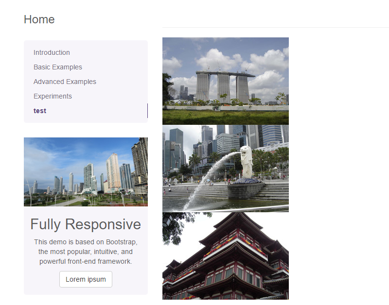

# Renderlet Editable

## General

The renderlet is a special container which is able to handle every element in Pimcore (Documents, Assets, Objects).
You can decide in your controller/action what to do with the element which is linked to the renderlet.
So it's possible to make a multifunctional area in editmode where the editor can drop anything on it.
A typical use-case would be to render product objects within a document. 

## Configuration

| Name           | Type      | Description                                                                                                    | Mandatory   |
|----------------|-----------|----------------------------------------------------------------------------------------------------------------|-------------|
| `action`       | string    | Specify action                                                                                                 | X           |
| `className`    | string    | Specify class name (if type **object** chosen)                                                                 |             |
| `controller`   | string    | Specify controller                                                                                             | X           |
| `height`       | integer   | Height of the renderlet in pixel                                                                               |             |
| `module`       | string    | Specify module (default: website)                                                                              |             |
| `reload`       | bool      | Reload document on change                                                                                      |             |
| `template`     | string    | Specify template                                                                                               |             |
| `title`        | string    | Add a title to the box in editmode                                                                             |             |
| `type`         | string    | The type of the element assigned to the renderlet (document,asset,object)                                      |             |
| `width`        | integer   | Width of the renderlet in pixel                                                                                |             |
| `class`        | string    | A CSS class that is added to the surrounding container of this element in editmode                             |             |
| `tag`          | string    | A tag name that is used instead of the default `div` for the surrounding container of this element in editmode |             |

Optionally you can pass every parameter (with a scalar data type) you like to the renderlet which can be accessed in 
the configured controller with `$this->getParam("yourKey")`.

## Methods

| Name            | Return    | Description                                                 |
|-----------------|-----------|-------------------------------------------------------------|
| `isEmpty()`     | bool      | Whether the editable is empty or not.                       |

## In the configured Controller Action

In the target controller action, you get the following parameters which can be accessed by `$this->getParam("key")`.

| Name       | Type                   | Description                                                                                      |
|------------|------------------------|--------------------------------------------------------------------------------------------------|
| `document` | Pimcore\Model\Document | If the element which is dropped on the renderlet is a document this parameter is defined.        |
| `id`       | integer                | The id of the element assigned to the renderlet                                                  |
| `object`   | Pimcore\Model\Object   | If the element which is dropped on the renderlet is an object this parameter is defined.         |
| `subtype`  | string                 | The subtype of the element assigned to the renderlet (folder, image, link, page, classname, ...) |
| `type`     | string                 | The type of the element assigned to the renderlet (document,asset,object)                        |

If you have defined any custom parameters on the renderlet configuration you can access them also with `$this->getParam()`.

## Example

The code below shows how to use renderlet to create gallery based on it. 

### Specify the Renderlet Editable in a Template

```php
<section id="renderlet-gallery">
    <?= $this->renderlet("myGallery", [
        "controller" => "content",
        "action" => "my-gallery",
        "title" => "Drag an asset folder here to get a gallery",
        "height" => 400
    ]); ?>
</section>
```

Now editors are able to put elements onto the renderlet in the editmode.


### Specify the Controller Action

```php
public function myGalleryAction()
{
    if($this->getParam('type') == 'asset') {
        $asset = Asset::getById($this->getParam('id'));
        if($asset->getType("folder")) {
            $this->view->assets = $asset->getChildren();
        }
    }
}
```

The action is responsible for validation and transferring assets to the view.
Of course, to limit access to the renderlet, you can use the `type` configuration option as well. 

### Create View

Now you have to create the template file at: `website/views/scripts/content/my-gallery.php`

```php
<?php
/** @var \Pimcore\View $this */
?>
<?php if($this->assets): ?>
    <div class="my-gallery">
        <?php
        foreach($this->assets as $asset):
            if($asset instanceof Pimcore\Model\Asset\Image):
                /** @var Pimcore\Model\Asset\Image $asset */
            ?>
            <div class="gallery-row">
                <?= $asset->getThumbnail('galleryThumbnail')->getHTML(); ?>
            </div>
        <?php
            endif;
        endforeach; ?>
    </div>
<?php endif; ?>
```

And the final view is like, below:



## Editmode

> Please be aware, that the renderlet itself is not editmode-aware. If you need to determine within the renderlet whether in editmode or not, you need to pass that parameter to the renderlet.

```php
$this->renderlet("myRenderlet", [
....
'editmode' => $this->editmode
]);
```

Within the renderlet, you can access the editmode parameter as follows:

```php
$this->getParam("editmode")
```