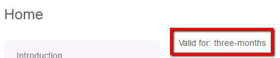

# Select Editable

## General

A selectbox implemention in documents.
The select editable generates **select** box component in Editmode, next you can use that value in your application.

## Configuration

| Name   | Type    | Description                                                     |
|--------|---------|-----------------------------------------------------------------|
| store  | array   | Key/Value pairs for the available options.                      |
| reload | bool    | Set true to reload the page in editmode after selecting an item |
| width  | integer | Width of the select box in pixel                                |

## Methods

| Name    | Type   | Description                                                           |
|---------|--------|-----------------------------------------------------------------------|
| getData | string | Value of the select, this is useful to get the value even in editmode |


## Examples

### Basic uage

The code below, shows a select box in editmode,
in the frontend preview you will see a simple text with rendered value of chosen option.

```php
<?php
if($this->editmode):

    echo $this->select("valid_for", [
            "store" => [
                ['one-month', 'One month'],
                ['three-months', 'Three months'],
                ['unlimited', 'Unlimited']
            ]
        ]);

else:
?>
<p>
    <?= $this->translate("Something is valid for") ?>: <?= $this->translate($this->select("valid_for")->getData()) ?>
</p>
<?php endif; ?>
```

Editmode:


Frontend:



### Preselect option

You can ***preselect*** an option in your select editable by using `setDataFromResource` method.

```php
if($this->editmode):
    if($this->select("valid_for")->isEmpty()):
        $this->select("valid_for")->setDataFromResource("unlimited");
    endif;
    
    ...
    
endif;
```