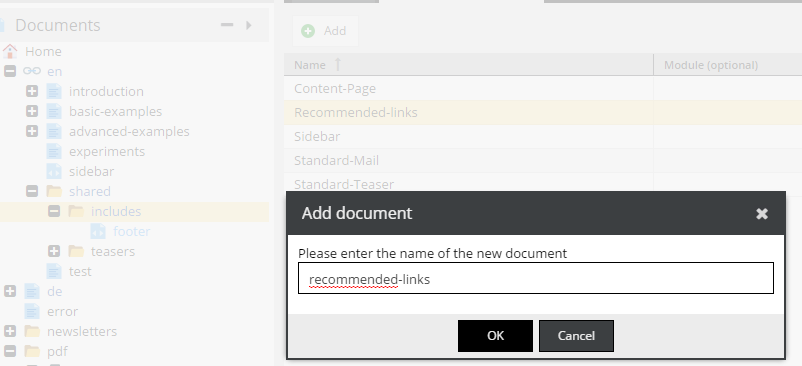
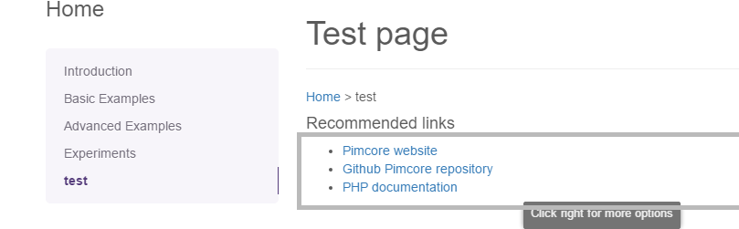
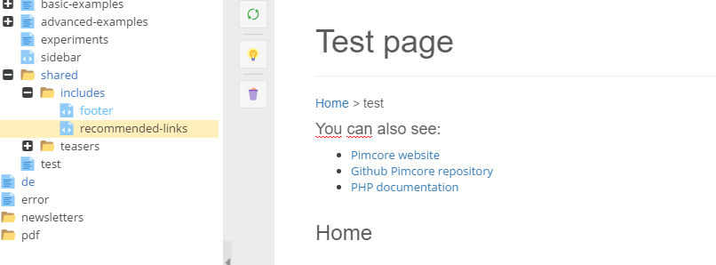

# Snippet Editable

[TOC]

## General

Use the snippet editable to embed a document snippet, for example teasers, boxes, footers, etc.

Snippets are like little documents which can be embedded in other documents. 
You have to create them the same way as other documents.

It is possible for users to drag snippets onto a document (like a sidebar item that is different on every page) or for the
developer to place one on a fixed position in a (layout) template (like footer that is the same on every page, see code example).

## Configuration

| Name          | Type    | Description                              |
|---------------|---------|------------------------------------------|
| defaultHeight | integer | A default height if the element is empty |
| height        | integer | Height of the snippet in pixel           |
| reload        | bool    | Reload document on change                |
| title         | string  | You can give the element a title         |
| width         | integer | Width of the snippet in pixel            |

## Accessible properties

| Name    | Type                           | Description                                         |
|---------|--------------------------------|-----------------------------------------------------|
| id      | integer                        | ID of the referenced Pimcore\Model\Document\Snippet |
| snippet | Pimcore\Model\Document\Snippet | referenced document snippet object                  |

## Examples

### Snippet creation

Let's create snippet with an additional links list to external services. We will use it in next examples.
 
To create your own snippet start with creating a PHP file in the directory `website/views/scripts/snippets`. 
This file can contain HTML and PHP code. You can add text input fields here. 
This file is the view that is being used for this snippet.

The file `website/controllers/SnippetsController.php` is the controller and contains the actions associated with all snippets. 
If you have named your view `footer.php` you should add a method `footerAction()` here. 
This method will be called every time the snippet is displayed. You can retrieve information from the database here and pass it on to the view here using `$this->view` and adding variables to it.

After creating the view and the action the snippet will not yet appear for the user. 
Before a snippet can be used you need to define it as a custom [Document Type](../07_Document_Types/07_Predefined_Document_Types.md).

#### Snippet template

Let's create the file `website/views/scripts/snippets/recommended-links.php` with contents like, below:

```php
<?php
/** @var \Pimcore\View $this */
?>
<ul id="recommended-links">
    <?php while($this->block("recommended_links", ["limit" => $this->limit])->loop()): ?>
    <li>
        <?= $this->link('rl_exernal', [
            "class" => "recommended-link"
        ]); ?>
    </li>
    <?php endwhile; ?>
</ul>
```

As you can see, above. I used the [Block](./06_Block.md) ans the [Link](./18_Link.md) editable to create the list of links.
There is also, the limit specified by a controller action. 

Next step is to specify the controller and the action.

#### Snippet action

If you haven't added a `SnippetController` it's a right time. 
Let's create the file `website/controllers/SnippetsController.php` and add there the `recommendedLinks` action:

```php
<?php

use Website\Controller\Action;

class SnippetsController extends Action
{
    public function recommendedLinksAction()
    {
        //the value specify links limit in the snippet
        $this->view->blockLimit = 4;
    }
}
```

#### Predefined snippet document type

<div class="inline-imgs">

Go to:  **Settings -> Document Types**

</div>

You can add some predefined document type. Let's call it Recommended-links (more about Predefined documents you can 
find in the [Document Types section](../07_Document_Types/07_Predefined_Document_Types.md)):


The last thing in the administration panel is to add a new document. 
We can put our snippet to the locked folder called `en/shared/includes`, like you can see on pictures, below.

Add menu:


Fill the name input:


You can add few links in the document and publish it (a similar example with a link / block connection you can find in details in the [Link section](./18_Link.md)). 


### Displaying a text from a snippet on every page

You can display a snippet on every page by using `inc` helper.

For example, if you want to show recommended-links on every page you can put the code below to the layout file `website/views/layouts/layout.php`

```php
<div id="special-links">
    <h4>
        <?= $this->translate("Recommended links"); ?>
    </h4>
    <?php 
        //if the location doesn't exists the snippet just won't be rendered
        echo $this->inc("/{$this->language}/shared/includes/recommended-links"); 
    ?> 
</div>
```

And the result is like in the picture



### The snippet helper - container

The snippet helper can be used if you need to specify container fot snippets in the layout.
In the example below I added the place for snippets in the `website/views/layouts/layout.php`` file. 

```php
<div id="special-links">
    <h4>
        <?= $this->input("headline_for_snippet"); ?>
    </h4>
    <?= $this->snippet("snippet_visible_on_every_page"); ?>
</div>
```

Now you're able to choose which snippet is rendered in the container (just drag a snippet document which you chose).


The final result:




## Getting a reference to the Document_Snippet object
Sometimes you need a reference to the snippet itself, for example to get a property. 
When trying to get a reference to the current snippet, you will find that $this->document will return a reference to the parent document in which the snippet has been embedded. 
he solution is to get the reference through the request object instead:

```php
$snippet = $this->getRequest()->getParam('document');
$myProperty = $snippet->getProperty('my-property-name');
```