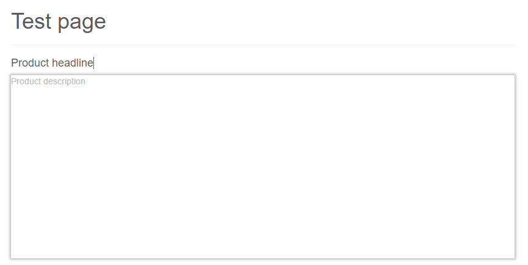

# Textarea

## General

Similar to the [Input](./16_Input.md) editable, Textarea could be use as a place when you can put some parts of a pure text. 
You can specify a css class of the table, auto `<br>` tags and few other you can find in the configuration table, below.


## Configuration

| Name             | Type    | Description                                                                         |
|------------------|---------|-------------------------------------------------------------------------------------|
| class            | string  | a css class that is added to the element only in editmode                           |
| height           | integer | Height of the textarea in pixel                                                     |
| htmlspecialchars | boolean | Set to false to get the raw value without HTML special chars like & (default: true) |
| nl2br            | boolean | Set to true to get also breaks in frontend                                          |
| placeholder      | string  | a placeholder that is displayed when the field is empty                             |
| width            | integer | Width of the textarea in pixel                                                      |


## Accessible properties

| Name | Type   | Description                                                             |
|------|--------|-------------------------------------------------------------------------|
| text | string | Value of the textarea, this is useful to get the value even in editmode |

## Example

```php
<p class="product-description">
    <?php echo $this->textarea("product_description", [
        "nl2br" => true,
        "height" => 300,
        "placeholder" =>
            "Product description"
    ]); ?>
</p>
```

In the edit mode you can see the textarea and the predefined ***placeholder***.
 



