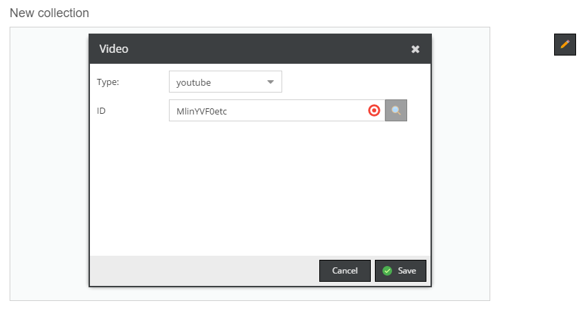
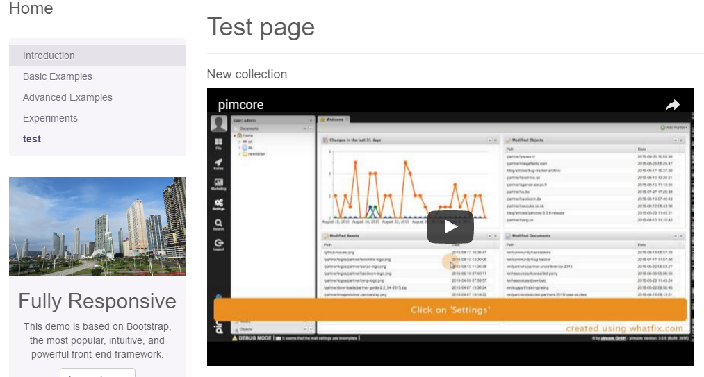

# Video

## General

The Video editable is a powerful tool which can place the video (in different types: local files, youtube, vimeo) in the content.
There are also options like: thumbnails creation, poster assets assigning...

## Configuration

| Name                    | Type      | Description                                                                                                                                                                                                             |
|-------------------------|-----------|-------------------------------------------------------------------------------------------------------------------------------------------------------------------------------------------------------------------------|
| attributes              | array     | Additional attributes for the generated ```<video>``` tag - only for type asset                                                                                                                                         |
| disableProgressReload   | bool      | set to true to disable the automatic page refresh while the video thumbnail is generated                                                                                                                                |
| editmodeImagePreview    | bool      | set to true to display only an image and not the video player in editmode, this can be necessary if you have many videos on one page (performance)                                                                      |
| height                  | integer   | Height of the video in pixel                                                                                                                                                                                            |
| imagethumbnail          | string    | Name of the image-thumbnail, this thumbnail config is used to generate the preview image (poster image), if not specified pimcore tries to get the information out of the video thumbnail. see also: Video Thumbnails   |
| removeAttributes        | array     | You can remove standard attributes using this configuration, e.g. "removeAttributes" => ["controls","poster"]                                                                                                           |
| thumbnail               | string    | Name of the video-thumbnail (required when using automatic-transcoding of videos) see: [Video Thumbnails](../../04_Assets/03_Working_with_Thumbnails/03_Video_Thumbnails.md)                                            |
| width                   | integer   | Width of the video in pixel                                                                                                                                                                                             |
| youtube                 | array     | Parameters for youtube integration. Possible parameters: [https://developers.google.com/youtube/player_parameters](https://developers.google.com/youtube/player_parameters) - only for type ***youtube***               |

## Methods

| Name                     | Arguments            | Return Value                                            | Description                                                                                   |
|--------------------------|----------------------|---------------------------------------------------------|-----------------------------------------------------------------------------------------------|
| getImageThumbnail($name) | (string/array) $name | string, absolute path to the thumbnail                  | get a specific image thumbnail of the video, or a thumbnail of the poster image (if assigned) |
| getPosterAsset()         |                      | Pimcore\Model\Asset                                     | returns the [assigned poster image asset](#posterReturnedValue)                                                       |
| getThumbnail()           | (string/array) $name | array, absolute paths to the different video thumbnails | get a specific video-thumbnail of the video                                                   |
| getVideoAsset()          | -                    | asset                                                   | returns the video asset object if assigned, otherwise null                                    |
| getVideoType()           | -                    | string, type of the video (asset,youtube,vimeo,url)     | this is to check which video type is assigned                                                 |

<a name="posterReturnedValue">&nbsp;</a>

Output returned by ```getPosterAsset```:
```
[status] => finished
[formats] => Array
    (
        [mp4] => /website/var/tmp/video_3414__example.mp4
        [webm] => /website/var/tmp/video_3414__example.webm
    )
```

## Accessible properties

| Name | Type   | Description                                         |
|------|--------|-----------------------------------------------------|
| id   | string | Asset-ID, YouTube-URL, Vimeo-URL, External-URL, ... |
| type | string | One of asset, youtube, vimeo, url, ...              |

## Examples

### Basic usage - a local file

To create a container for local video files you can just use ```video``` helper without any requried parameters.
See the code, below.

```php
<section id="campaign_video">
    <?php echo $this->video("campaignVideo", [
        "width" => 700,
        "height" => 400
    ]); ?>
</section>
```

In the editmode, there is now available the container where you can specify an asset path and a video poster. 


### YouTube & Vimeo

You can put videos from external services, as well (at the moment, YouTube and Vimeo).
In the video edit dialog, change the type to ```youtube``` and fill the **ID** input with a video identifier 
(in that case you can easily find it in the url).



Have a look at the frontend preview:
 


In the configuration, you could also specify additional options for external services.

```php
<section id="campaign_video">
    <?php echo $this->video("campaignVideo", [
        "width" => 700,
        "height" => 400,
        "youtube" => [
            "autoplay" => 1,
            "modestbranding" => 1
        ],
        "vimeo" => [
            "autoplay" => 1,
            "loop" => 1
        ]
    ]); ?>
</section>
```

### HTML5 with automatic Video transcoding (using video.js)
```php
<!DOCTYPE HTML>
<html>
<head>
    <link href="http://vjs.zencdn.net/5.4.4/video-js.css" rel="stylesheet">
</head>
<body>
 
    <?php echo  $this->video("myVideo", array(
        "thumbnail" => "example", // NOTE: don't forget to create a video thumbnail
        "width" => 400,
        "height" => 300,
        "attributes" => ["class" => "video-js custom-class", "preload" => "auto", "controls" => "", "data-custom-attr" => "my-test"]
    )); ?>
 
    <script src="http://vjs.zencdn.net/5.4.4/video.js"></script>
</body>
</html>
```

Find out more about Thumbnails in [the dedicated section](../../04_Assets/03_Working_with_Thumbnails/03_Video_Thumbnails.md).

