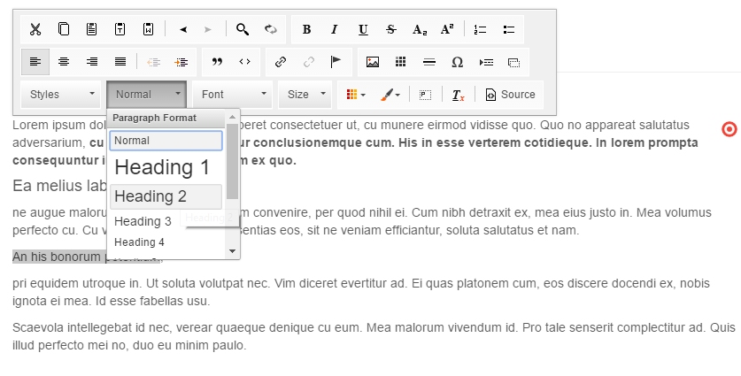
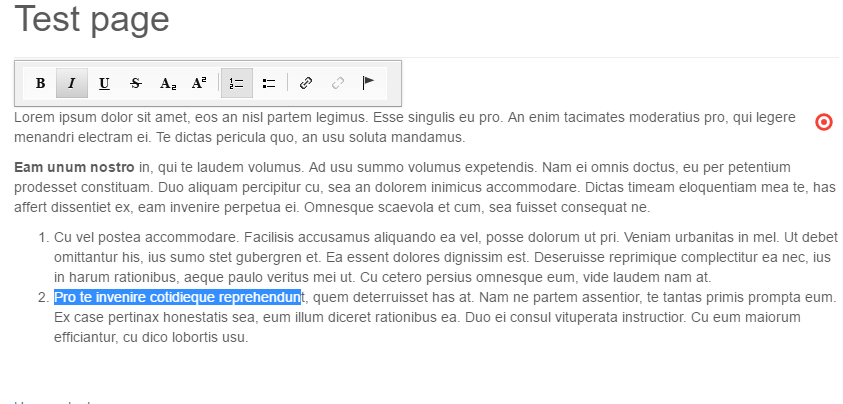
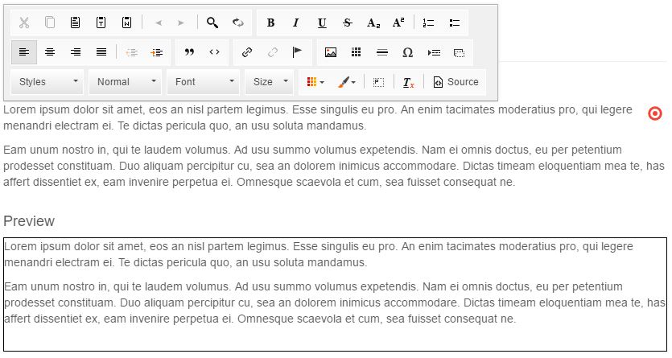

# WYSIWYG Editable

## General

Similar to Textarea and Input you can use the WYSIWYG editable in the templates to provide rich-text editing.
 
## Configuration

| Name            | Type    | Description                                                                        |
|-----------------|---------|------------------------------------------------------------------------------------|
| `customConfig`  | string  | Path to Javascript file with configuration for CKEditor                            |
| `enterMode`     | integer | Set it to 2 if you don't want to add the P-tag                                     |
| `height`        | integer | Minimum height of the field in pixels                                              |
| `toolbarGroups` | string  | A toolbar config array (see below)                                                 |
| `width`         | integer | Width of the field in pixels                                                       |
| `class`         | string  | A CSS class that is added to the surrounding container of this element in editmode |

## Methods

| Name        | Return | Description                           |
|-------------|--------|---------------------------------------|
| `getData()` | array  | Get the value of the wysiwyg          |
| `isEmpty()` | bool   | Whether the editable is empty or not. |

## Examples

### Basic usage

`wysiwyg` helper doesn't require any additional configuration options.
The following code specifies tje height for the rendered WYSIWYG editable (has no effect in frontend).

```php
<section id="marked-content">
    <?= $this->wysiwyg("specialContent", [
        "height" => 200
    ]); ?>
</section>
```

If you have a look at the editmode, you will see that our WYSIWYG is rendered with the full toolbar.




### Custom configuration for CKEditor

The complete list of configuration options you can find in the [CKEditor toolbar documentation](http://docs.ckeditor.com/#!/guide/dev_toolbar).

The WYSIWYG editable allows us to specify the toolbar. 
If you have to limit styling options (for example only basic styles like `<b>` tag and lists would be allowed), just use `toolbarGroups` option.

```php
<section id="marked-content">
    <?= $this->wysiwyg("specialContent", [
        "height" => 200,
        "toolbarGroups" => [
            [
                "name" => 'basicstyles',
                "groups" => [ 'basicstyles', 'list', "links"]
            ]
        ]
    ]); ?>
</section>
```

Now the user can use only the limited toolbar.




There is also an additional way to specify the configuration by adding `customConfig`. 

```php
<section id="marked-content">
    <?= $this->wysiwyg("specialContent", [
        "height" => 200,
        "customConfig" => "/custom/ckeditor_config.js"
    ]); ?>
</section>
```

##### Global Configuration
You can add a Global Configuration for all WYSIWYG Editors for all documents by setting ```pimcore.document.tags.wysiwyg.defaultEditorConfig```

For this purpose, you can create a plugin and add the configuration in the new created file `/plugins/MyPlugin/static/js/editmode.js` like this:
```
pimcore.document.tags.wysiwyg.defaultEditorConfig.allowedContent = true;
```

and add the file to your `plugin.xml`: 
```xml
<pluginDocumentEditmodeJsPaths-extjs6>
    <path>/Frischeis/static6/js/editmode.js</path>
</pluginDocumentEditmodeJsPaths-extjs6>
```

### Text Output in Editmode

With the following code you can get the text even in editmode:

```php
<?= $this->wysiwyg("specialContent"); ?>
<?php if($this->editmode): ?>
    <h4>Preview</h4>
    <div style="border: 1px solid #000;" class="preview">
        <?= $this->wysiwyg("specialContent")->getData(); ?>
    </div>
<?php endif; ?>
```

