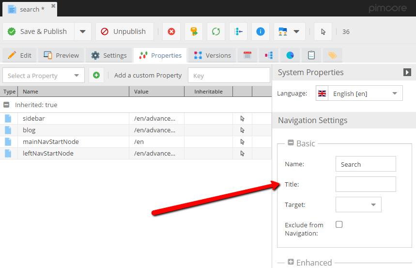

# Navigation

## Basics

Pimcore comes with a standard navigation implementation in the form of a view helper, which utilizes Zend_Navigation. 
The `Pimcore\View\Helper\PimcoreNavigation` gets registered by default with the other Pimcore view helpers. 
It builds a [Zend_Navigation](https://framework.zend.com/manual/1.10/en/zend.navigation.introduction.html) container based on the existing document structure and needs to be set up as follows in your view script or layout script:

**Only documents are included** in this structure, directories are ignored, regardless of their navigation properties.

```php
// get root node if there is no document defined (for pages which are routed directly through static route)
if(! $this->document instanceof \Pimcore\Model\Document\Page) {
    $this->document = \Pimcore\Model\Document\Page::getById(1);
}

// get the document which should be used to start in navigation | default home
$navStartNode = $this->document->getProperty("navigationRoot");
if(!$navStartNode instanceof \Pimcore\Model\Document\Page) {
    $navStartNode = \Pimcore\Model\Document\Page::getById(1);
}
/** @var \Pimcore\View\Helper\PimcoreNavigation $mainNavigation */
$mainNavigation = $this->pimcoreNavigation($this->document, $navStartNode);
```

Having set up the navigation view helper as shown above, you can easily use the Zend Navigation Helpers to render a navigation tree, or breadcrumbs.

### Meta Navigation - Only the 1st Level

```php
<?php
$navigation = $mainNavigation->getContainer();
?>

<div class="my-menu">
    <?= $mainNavigation->menu()->renderMenu($navigation, ["maxDepth" => 0]); ?>
</div>
```

### Breadcrumbs

```php
<div class="my-breadcrumbs">
    <a href="/">Home</a>
    <?= $mainNavigation->breadcrumbs()->setMinDepth(null); ?>
</div>
```

### Sidebar Navigation

```php
<div class="my-sidebar-menu">
    <?= $mainNavigation->menu()->renderMenu($navigation); ?>
</div>
```

### Sidebar Navigation with a Different HTML Prefix

```php
<div class="my-sidebar-menu">
    <?php
        echo $this->pimcoreNavigation($this->document, $navStartNode, 'my-nav-')->menu()->renderMenu(null, [
            'ulClass' => 'nav my-sidenav',
            'expandSiblingNodesOfActiveBranch' => true
        ]);
    ?>
</div>
```

The renderMenu() method renders the menu to the deepest available level. 
Levels trees which are not within the active tree, and levels below the latest active page must be hidden using css. 

The example css below shows how to do that (includes 3 Levels):

```css
#navigation ul li ul {
    display:none;
}
 
#navigation ul li.active ul {
    display:block;
}
 
#navigation ul li.active ul li ul {
    display:none;
}
 
#navigation ul li.active ul li.active ul {
    display:block;
}
 
#navigation ul li.active ul li.active ul li ul {
    display:none;
}
 
#navigation ul li.active ul li.active ul li.active ul{
    display:block;
}
```

## Setting a Document's Navigation Property



Pages and links have **Navigation Settings** in their system properties as shown in the screen above. 
These navigation settings include the following properties:

* **Name:** Document's name used in the navigation (label).
* **Title:** Document's title used in the navigation - the HTML Attribute title.
* **Target:** Link target (`_blank`, `_self`, `_top`, `_parent`)
* **Exclude from Navigation:**  Property to quickly exclude a page from the navigation.
 
 In your view template you can use:
 
 ```php
 $this->document->getProperty('navigation_exclude')
 ```
 
* **Class:** HTML class of the navigation element
* **Anchor:** Anchor appended to the document's URL
* **Parameters:** Parameters appended to the document's URL
* **Relation:** Only available in custom navigation script. Supposedly the HTML rel attribute to open the link in a sort of Lightbox / Clearbox
* **Accesskey:** Only available in custom navigation script
* **Tab-Index:** Only available in custom navigation script

## Individual (Partial) Navigation View Script
If the standard HTML output of the render() method is not suitable for a project, there is the possibility to provide a custom script for the menu HTML. 
This can be achieved using the renderPartial() method of the **Zend Menu Helper** (`\Zend_View_Helper_Navigation_Menu::renderPartial`).

For example, inside your view:

```php
<?php
    $this->pimcoreNavigation($this->document, $mainNavStartNode)->menu()->setPartial('includes/navigation.php')->render();
?>
```

`website/views/scripts/includes/navigation.php`

```php
<?php foreach($this->container as $page): ?>

    <div class="my-menu-element">

        <?= $this->navigation()->menu()->htmlify($page); ?>

    </div>

<?php endforeach; ?>
```

## `Document\Link` Navigation Properties

A Document_Link has three properties which are not covered by `Zend_Navigation` by default. 
These are tabindex, accesskey and relation. Since the `Zend_Navigation` container 
contains instances of `Pimcore\Navigation\Page\Uri`, which extend `Zend_Navigation_Page_Uri`, 
these additional properties are available and accessible through their according getters. 

Consequently, they can be regarded in an individual (partial) view script for the navigation, but will be ignored by the default render() methods.

## Using the Navigation Helper with Sites.

For example:
```php
$navStartNode = $this->document->getProperty("navigationRoot");
if(!$navStartNode instanceof Document\Page) {
    if(Site::isSiteRequest()) {
        $site = Site::getCurrentSite();
        $navStartNode = $site->getRootDocument();
    } else {
        $navStartNode = Document::getById(1);
    }
}
 
<?= $this->pimcoreNavigation($this->document, $navStartNode)->menu()->renderMenu(null, [
        "maxDepth" => 1,
        "ulClass" => "nav navbar-nav"
    ]);
?>
```

## Using Partials Generating a Customized Navigation

For example, generate bootstrap 3.0 style navigation: 

```php
<?php
$navStartNode = $this->document->getProperty("navigationRoot");
if(!$navStartNode instanceof Document\Page) {
    if(Site::isSiteRequest()) {
        $site = Site::getCurrentSite();
        $navStartNode = $site->getRootDocument();
    } else {
        $navStartNode = Document::getById(1);
    }
}
?>
<nav class="navbar-inverse navbar-static-top" role="navigation">
<div class="container-fluid">
    <div class="navbar-header">
        <button type="button" class="navbar-toggle" data-toggle="collapse" data-target="#bs-navbar-collapse-1">
            <span class="icon-bar"></span>
            <span class="icon-bar"></span>
            <span class="icon-bar"></span>
        </button>
    </div>
    <div class="collapse navbar-collapse" id="bs-navbar-collapse-1">
        <ul class="nav navbar-nav">
        <?php $mainNavigation = $this->pimcoreNavigation()->getNavigation($this->document, $navStartNode); ?>
        <?php foreach ($mainNavigation as $page) { ?>
            <?php /* @var $page Zend\Navigation\Page\Mvc */ ?>
            <?php // here need to manually check for ACL conditions ?>
            <?php if (!$page->isVisible() || !$this->navigation()->accept($page)) { continue; } ?>
            <?php $hasChildren = $page->hasPages(); ?>
            <?php if (!$hasChildren) { ?>
                <li>
                    <a href="<?= $page->getHref() ?>">
                        <?= $this->translate($page->getLabel()) ?>
                    </a>
                </li>
            <?php } else { ?>
            <li class="dropdown">
                <a href="<?= $page->getHref(); ?>"><?= $this->translate($page->getLabel()) ?></a>
                <ul class="dropdown-menu">
                    <?php foreach ($page->getPages() as $child) { ?>
                        <?php if(!$child->isVisible() || !$this->navigation()->accept($child)) { continue; } ?>
                        <li>
                            <a href="<?= $child->getHref() ?>">
                                <?= $this->translate($child->getLabel()) ?>
                            </a>
                        </li>
                    <?php } ?>
                </ul>
            </li>
            <?php } ?>
        <?php } ?>
    </ul>
    </div>
</div>
</nav>
```

## Adding Custom Items to the Navigation

In the following example we're adding news items (objects) to the navigation using the callback. 

```php
<?php
/** @var \Pimcore\View\Helper\PimcoreNavigation $navigation */
$navigation = $this->pimcoreNavigation($this->document, $navStartNode, null, function($page, $document){
    /** @var $document \Pimcore\Model\Document */
    /** @var \Pimcore\Navigation\Page\Uri $page */
    if($document->getProperty("templateType") == "news") {
        $list = new \Pimcore\Model\Object\News\Listing;
        $list->load();
        foreach($list as $news) {
            $detailLink = $this->url([
                "id" => $news->getId(),
                "text" => $news->getTitle(),
                "prefix" => $this->document->getFullPath()
            ], "news", true);

            $uri = new Pimcore\Navigation\Page\Uri([
                "label" => $news->getTitle(),
                "id" => "object-" . $news->getId(),
                "uri" => $detailLink
            ]);
            $page->addPage($uri);
        }
    }
});

?>

<div class="my-navigation">
    <?= $navigation->menu()->renderMenu(null, [
        'ulClass' => 'nav my-sidenav',
        'expandSiblingNodesOfActiveBranch' => true
    ]); ?>
</div>
```

## Caching / High-Performance Navigation

The navigation tree / container (`Zend_Navigation_Container`) is automatically cached by pimcore and improves significantly the performance of navigations. 
To benefit from the cache it's absolutely necessary to don't use `Pimcore\Model\Document` objects directly in the navigation templates / partial scripts, because this would result in loading all the documents again in the navigation.

But sometimes it's necessary to get some properties or other data out of the documents in the navigation to build the navigation as it should be. 
For that we've introduced a new parameter for the pimcoreNavigation view helper, which acts as a callback and allows to map custom data onto the navigation page item.

```php
<?php
$mainNavigation = $this->pimcoreNavigation($this->document, $mainNavStartNode, null, function ($page, $document) {
    $page->setCustomSetting("myCustomProperty", $document->getProperty("myCustomProperty"));
    $page->setCustomSetting("subListClass", $document->getProperty("subListClass"));
    $page->setCustomSetting("title", $document->getTitle());
    $page->setCustomSetting("headline", $document->getElement("headline")->getData());
});
$mainNavigation->menu()->setPartial("/navigation/partials/navigation.php");
echo $mainNavigation->render();
?>
```

Later in the template of the navigation (`/navigation/partials/navigation.php`) you can use the mapped data directly on the page item object.

```php
<?php foreach( $this->container as $page ){ ?>
    <?php if($page->isVisible()){ ?>
         <li class="<?php if( $page->getActive(true) ){ ?>active<?php } ?>">
          <a href="<?= $page->getUri() ?>" target="<?= $page->getTarget() ?>"><?= $page->getLabel() ?></a>
          <ul class="<?= $page->getCustomSetting("subListClass") ?>" role="menu">
                <?php $this->template( "/navigation/partials/main.php", [ "container" => $page->getPages() ] ); ?>
          </ul>
     </li>
    <?php } ?>
<?php } ?>
```

Using this method will dramatically improve the performance of your navigation. 

### Dynamic Key for the Navigation Cache

Sometimes it's necessary to manually set the key for the navigation cache. 

```php
$this->pimcoreNavigation($this->document, $mainNavStartNode, null, null, "yourindividualkey");
```

### Disabling the Navigation Cache

You can disable the navigation cache by setting the 5th argument to `false`.

```php
$this->pimcoreNavigation($this->document, $mainNavStartNode, null, null, false);
  
// or
  
$this->pimcoreNavigation()->getNavigation($this->document, $navStartNode, null, null, false);
```

## FAQ

**A document does not show up in the navigation. Why?**

Please make sure that the documents and its parent documents are published and that the document it self as well as all it's parents have a navigation name set. 
Neither the document itself nor one of it's parent documents may have activated **Exclude From Navigation** in their properties. (`Document properties -> System properties`)

**Why is the navigation not appearing?**

See the above question. If none of the documents have a navigation title set the render function will simply return nothing.

**Why is the homepage not appearing in the navigation?**

The homepage will not appear in the navigation by default. You can add the homepage (and any other page) manually:

```php
$navigation->addPage([
   'order' => -1, // put it in front of all the others
   'uri' => '/', //path to homepage
   'label' => 'home', //visible label
   'title' => 'Homepage' //tooltip text
]);
```

If you retrieve the **home** document (which always has the ID 1) you can also retrieve its navigation properties so that they can be edited from the Pimcore admin interface like all the other documents.

```php
$home = Document::getById(1);
 
$navigation->addPage([
    'order' => -1, // put it in front of all the others
    'uri' => '/', //path to homepage
    'label' => $home->getProperty('navigation_name'), //visible label
    'title' => $home->getProperty('navigation_title'), //tooltip text
    'active' => $this->document->id == $home->id //active state (boolean)
]);
```
