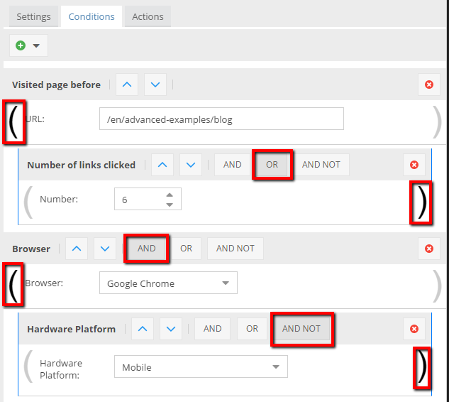
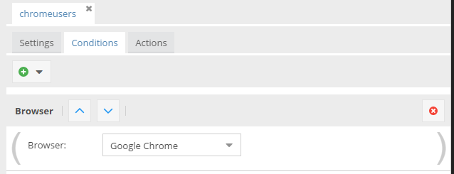
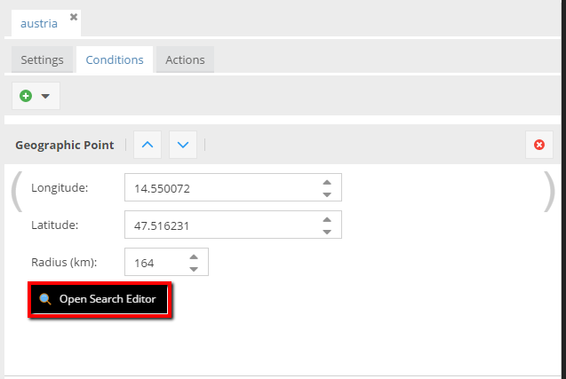
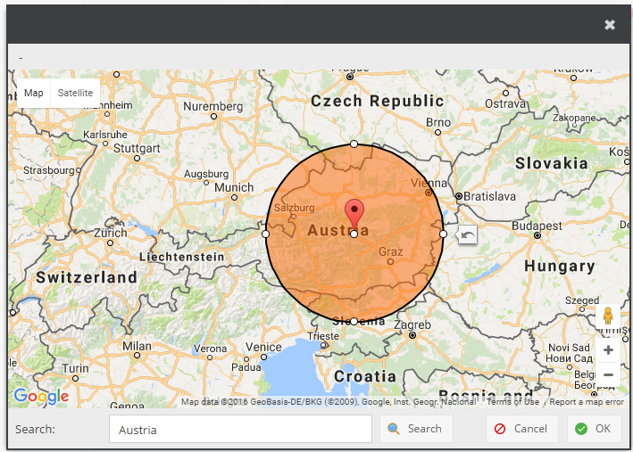
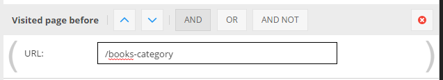
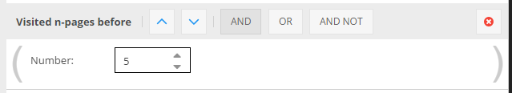
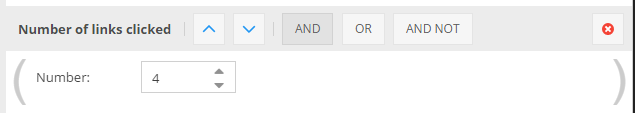

# Global targeting rules conditions
 
## Combining conditions
 
Due to very advanced configurator built-in global targeting rules, you're able to specify unlimited conditions responsible for defined actions. 
Have a look at the picture below.

As you can see, Pimcore makes it possible to create very complex conditions with little effort. 
You can combine conditions with basic boolean operators: AND, OR & AND NOT. Additionally you can combine subconditions with parentheses.

## URL (RegExp)

Regex of URLs to match. Use single backslash to escape question mark if needed `\?`.

## Browser

Browser condition gives ability to identify a user by the browser application which he or she is using.

## Country

That condition could associate user by a country.

## Language

## Event

How to add Events you can find in the [Actions section](./04_Actions.md).
That condition checks if event exists in the activity log.

## Geographic point

It helps you to relate a user to the defined geographic area.
There is the form where you can put coordinates, also you're able to mark interesting area in the map. 

## Referring Site

Regex for referrer URL. Use single backslash to escape question mark if needed `\?`.

## Search Engine

Checks if visitor came to site from Search Engine - Google, Bing, Yahoo!. This condition is similar to Referring Site 
condition, so you can check for other search engines by using the Referring Site condition. 

## Visited page before

Checks if user visited certain page before - Regex of the page URL. Use single backslash to escape question mark if needed `\?`.

## Visited n-pages before

Condition is true if user visited at least the number (set in condition) of pages before.

## Time on site

Condition is true if user is on the site for at least the duration set.

## Link clicked

Checks if user clicked on a certain link before - Regex of the link's href attribute. Use single backslash to escape question mark if needed `\?`.
Pimcore's targeting system adds event listener to all links on the  page, so you can add unique IDs to href attribute of links to recognize their origin. 

## Number of links clicked

Condition is true if user clicked at least the number of links set in the condition.

## Hardware platform

Hardware detection is based on the User Agent.

## Operating system

Operating system check is based on the User Agent.

## Personas

Check if user has the specified Persona assigned.

