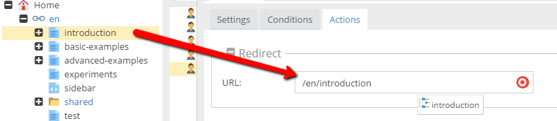

# Global targeting rules actions

## General

Actions available in global targeting rules feature could be used to start some process when defined conditions are met.

Some cases
* Redirect user to English version of the site when he / she is from the USA.
* Add a popup activation javascript snippet to the code when a user is active on the site more than 3 minutes.
* Save value in the activity log when a user clicks on the *add to cart* button.
 
## Available actions

### Redirect

Redirect to document (by drag & drop) or any other url.

### Programmatically

Enables developers to handle this action in the code.
See [Interacting with the targeting & personalization engine](./README.md#Interacting_with_targeting_and_personalization_engine)

**Note:** This option is turned on just by expanding this section. 

### Event

Event key and value are saved to the user's (local storage) activity log.
Another Global Targeting Rule can then respond to this rule in combination with any of the other conditions.

### Code-Snippet

Injects any code to frontend HTML. Anything that can be interpreted in the browser can be injected - JavaScript, CSS, HTML.

**Element** - body, head or any other element (use CSS selector)

**Insert position** -  inject the code in the beginning, the end of the element or completely replace element's contents.

### Associate Target Group (Personas)

Assigns the selected Persona to the visitor.

