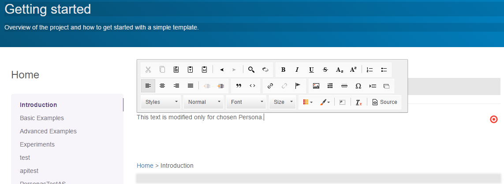
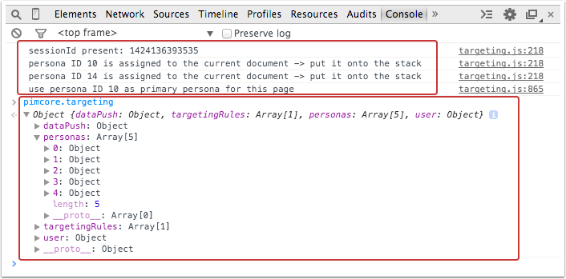

# Targeting and Personalization

[TOC]

## General

### Description

Pimcore's on-site behavioral targeting engine is using an innovative technological approach which makes it possible that 
no personal data is transferred from the visitor to the server and that no visitor's private data is stored on the server.

All the rules and actions added in the backend are evaluated and ran in frontend by visitor's browser (Javascript). 
As everything happens on visitor's side, no personal data is sent to the server.

If explicitly needed we can access the matching Persona in the backend, but not directly visitor's data.

The javascript needed for the targeting functionality is automatically injected to the frontend HTML by a Frontend Controller 
Plugin, when the targeting functionality is in use. Additionally all rules and configs off all personas are also injected into `<head>`, so browser can evaluate and execute them in the frontend.

Pimcore's targeting system needs to log some of the user's activity (clicked links, matching rules, events and page views) in order to make all of its functionality possible. 
All the tracked data is saved only on the client side (HTML5 Local storage with key pimcore_targeting_user) without using cookies!

### GET parameters
After the rules are evaluated, Pimcore redirects to the same URL with any of these three GET params added to identify 
further actions in the backend or frontend (values of params are one or more comma delimited IDs of Personas). Eg. http://domain/?_ptc=3,4,5:

* **_ptr** *redirect action (GET)*. When this parameter is available, frontend JS will trigger redirect to the URL set in the backend
* **_ptc** *programmatically redirect action (GET)*. This parameter is set when **Programatically** action is enabled. Developer can [respond to this parameter either in the backend (PHP) or in the frontend (Javascript)](#Interacting_with_targeting_and_personalization_engine)
* **_ptp** *persona variant of document page (GET)*. This parameter loads the [personalized version of the document](#Document_personalization).

## Managing

You can find *"Targeting and Personalization"* features in the **Marketing -> Personalization / Targeting** section.


### Global targeting rules

* global targeting rules conditions are evaluated on every visit - actions are called based on scope of rule
* 15 conditions can be evaluated: [See the Conditions section](./02_Conditions.md)
* rules tie together conditions, personas and actions
* global targeting rule can assign a Persona to a visitor
* scope
    * **Hit** Actions are called on every request when conditions are met.
    * **Session** Actions are called only once per session. New session is started if more than 30 minutes has passed since the last action.
    * **User** Actions are called only once per user when conditions are first met.

### Personas (Target groups)

* [entry conditions](./02_Conditions.md) are checked only at the first visit of a user
* has a subset of global targeting rules [conditions](./02_Conditions.md)
* [document content can be overridden based on persona](#Document_personalization)
* personas can be assigned to visitors in following ways
    * visitor passes personas conditions
    * a document page assigns a persona to a visitor when visited **document page > settings > associate target group (personas)**
    * global targeting rule assigns persona
    * [PHP script assigns persona](#Interacting_with_targeting_and_personalization_engine)
* to see assigned personas put this into your developer tools console: `pimcore["targeting"]["user"]["personas"]`
* threshold - used for getting the primary persona and to specify which personified variant of the page to display. If the number of times a persona is assigned is below the threshold the persona will not be used as primary.

### Primary persona
A persona can be assigned to a visitor multiple times. The amount of assignations and Persona's threshold determine which persona is the Primary persona. 
This persona also defines which personalized variant of document to display.

Persona can be Primary only if the number of assignations is equal or bigger than the threshold of the persona.

*Example*: visitor visits three sites that assign a persona *"VisitorOfLaptopProducts"*. This persona has a threshold of 3 set. 
On 4th visit this will become the primary persona and we can display in sidebar additional deals on laptop products as this will now be the most relevant data to display.

The primary persona can be retrieved in frontend by the `pimcore.targeting.user.persona` variable.

**Please note:** The persona's conditions are evaluated and assigned only once per session. 
To assign a persona multiple times, use Global Targeting Rules or assign them programatically.

## Document personalization
<a name="Document_personalization">&nbsp;</a>

### Editmode - step by step

It is extremely easy to create per-persona customized document variants by overriding only the elements you need to change. 
All other elements are inherited from base document.


* In the document editmode click the Persona button (the left / bottom corner) 


* Choose a Persona 


* **Right click** on the content block you want to override and click **Override**


* Personalize the content. You need to edit only overridden blocks, all the other content will be inheritet from the general document.



### Preview personalized variants of document

You can view different variants of document in the frontend by using `_ptp` parameter in the url. 
For example `http://your.domain/some_page?_ptp=7,5` will show tou the page visible by Persona with ids 5 and 7.

## Assign Personas based on visited pages

We can assign Personas based on the document pages user visits.
In **Settings** tabs, there is available **Associate Target Group (Personas)** option.


This allows for advanced content personalization.

Use case example:

* user visits page with Books product listing - booksInterest persona is assigned
* user visits page with Sport items product listing - sportInterest persona is assigned
* based on these two personas we can display product suggestions from category Books about sport by creating a rule that has both personas set as condition

Persona is assigned **each** time user visits the page.

<a name="Interacting_with_targeting_and_personalization_engine">&nbsp;</a>
## Interacting with the targeting & personalization engine

### PHP / Server

Expand [Programatically section in Rule Actions](./04_Actions.md) to turn it **ON**. 
After javascript evaluates condition it will refresh and add **_ptc** GET param with IDs of matching targets.
`http://your.domain/?_ptc=3,5`

Get ID of Persona in a controller action

```php
$targetingRulesIds = json_decode("[" . $this->getParam("_ptc") . "]", true);
```

Assign Persona in controller

```php
$personaId = 10;

$frontController = \Zend_Controller_Front::getInstance();
 
/* @var Pimcore\Controller\Plugin\Targeting $targetingPlugin */
if (!$this->view->editmode & !\Pimcore\Tool::isFrontentRequestByAdmin()) {
    $targetingPlugin = $frontController->getPlugin("Pimcore\\Controller\\Plugin\\Targeting");
    $targetingPlugin->addPersona($personaId);
}
```

### Javascript / Browser

Expand [Programatically section in Rule Actions](./04_Actions.md) to turn it **ON**. 
After javascript evaluates condition it will refresh and add **_ptc** GET param with IDs of matching targets to the request.
`http://your.domain/?_ptc=3,5`

Get ID of Persona in the frontend

```javascript
var targetingRulesIds = window.location.search.match(/(\?|&)_ptc\=([^&]*)/)[2].split(",");
```

## Targeting: tips for developers

### Examine targeting data

Pimcore logs targeting actions to console. If you want to further examine targeting data enter this:

```javascript
pimcore.targeting
```



### Examine Targeting local storage

