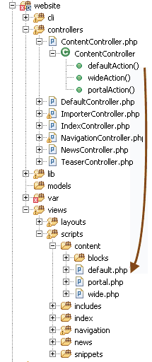
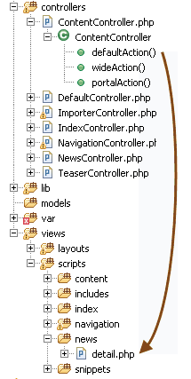
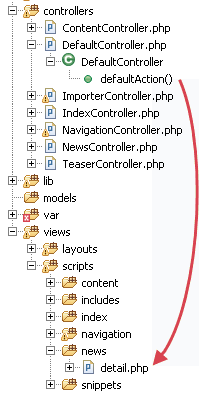

# Documents

## General

Every Pimcore document has a unique path (in the document tree) which directly represents the address in the browser.
When a visitor requests a page at a specific address, Pimcore uses a route in the front controller that determines if there is a suitable document for the requested address.
If there is a document, the route then uses the controller, action and view defined in the document's settings, passing them to the dispatcher along with the document itself.

The requested document is then available as a property in the controller, which is defined for the document (`$this->document`).
Read more about Controllers in [Controllers section](../02_MVC/00_Controller.md).

## File Structure

There are three important folders within the `/website` folder that correspond to documents.

| Path                       | Description                                                                                                                                         | Example                                                                                                                              |
|----------------------------|-----------------------------------------------------------------------------------------------------------------------------------------------------|--------------------------------------------------------------------------------------------------------------------------------------|
| /website/controllers       | The controllers directory, the naming follows the Zend Framework naming-convention                                                                  | `ContentController.php`                                                                                                              |
| /website/views/layouts     | Optionally: here you can put your layouts which are used by pages                                                                                   | `layout.php` (this is the default when enabled)                                                                                      |
| /website/views/scripts     | The template directory, the naming (sub-folders) follows also the naming-convention of ZF (`/website/views/scripts/[controller]/[action].php`)       | `/website/views/scripts/content/view-single.php`  if the above controller were to contain an action called `viewSingleAction`)   |

## Document Configuration

The controller/action and the template are directly specified in the document settings in the admin interface: 

Not all of them are necessary, the table below shows which configurations are possible:

| Type | Controller | Action | Template | Description                                                                                                                                        |
|------|------------|--------|----------|----------------------------------------------------------------------------------------------------------------------------------------------------|
| 1    | X          | X      |          | The specified controller/action is executed, based on the names of them the right template is rendered (eg. `views/scripts/controller/action.php`) |
| 2    | X          | X      | X        | Same as above but the template specified is rendered and not the autodiscovered template                                                           |
| 3    |            |        | X        | Renders the template with the default controller/action, this is practical if there is only templating stuff                                       |

Optionally you can specify a module to each of the above combinations, this is useful if you want to use controllers/actions or templates out of plugins which are simply another ZF module. 
The default module (when empty) is website.

Pimcore is shipped with a default controller containing a default action, which is called when only a template is given to the document, 
you can edit the defaults in *Settings* > *System Settings*.

## Putting Configuration & Files Structure Together

The previous two sections outline how documents can be configured to use different controller/action and views.  
The table below represents the three configurations.

[comment]: #TODOimagesformatindaux

| Controller and Action                                                                                                                                       | Controller, Action and Template                                                          | Only Template                                                                                                       |
|-------------------------------------------------------------------------------------------------------------------------------------------------------------|------------------------------------------------------------------------------------------|---------------------------------------------------------------------------------------------------------------------|
|                                                                                   |       |                                               |
| If you have a controller named `content` with an action named `defaultAction` the template file required will be `/website/views/scripts/content/default.php` | The specified controller/action is executed, but then the specified template is rendered | The default controller/action defined in the system settings are executed, then the specified template is rendered. |

## Document Properties

Properties are very powerful in combination with documents.
Below, you can find some examples where document properties can be very useful.

1. **Navigation** - If you build the navigation based on the document-tree, sometimes you don't want a page to appear in the navigation, in this case you can define a property (eg. `excludeFromNav [boolean]`) while iterating through the tree in the templates, check the current document for this property if its true don't display it in the navigation.
2. **Header Images** - Often there are header images on a website, if you don't want to define it for every page, you can use the properties, because of their inheritance you can define a default one at the root document, and overrule this in a deeper document.
3. **Sidebars** - You can easily manage visibility of sidebars in specific documents, using properties.
4. **SEO** - You also can use properties for SEO. It's very painful to define a nice title and description for every page on your site, with properties this is not necessary.
5. **Protected Areas** - Closed user groups
6. Change the appearance of the website depending on the properties (eg. Microsites, nested sites)
7. Mark them for some automated exports (PDF, RPC's, …)

As you can see there are really useful cases for properties, feel free to use them for whatever they seem to be useful.

## A Few Facts

* Documents follow the MVC pattern; therefore, Pimcore requires that there is at least one controller with an action and a view file.
* Pimcore comes with a DefaultController containing a defaultAction and a view file.
* Because of the MVC architecture, there is a clear separation between your data, the functionality and the templates.
* Pimcore uses autoloaders like `\Zend_Loader_Autoloader` and the Composer autoloader, so you don't have to include your files manually, but you have to respect the naming of the files and classes (PSR-0, PSR-4, PEAR, ZF, ...). 
* If you like to use other libraries with pimcore check if they are available through composer. Of course you can also use additional custom autoloaders. 
* Pimcore has no need for a template engine since it uses `\Zend_View`, which offer many advantages. If you don't know how Zend_View works, please read more [here](https://framework.zend.com/manual/1.12/en/zend.view.html).
* The normal way to create templates for Pimcore is to use pure PHP. There's no new template syntax to learn - just code what you want - feel free!
* Although the templates are written in PHP, there is a clear separation as mentioned before.

