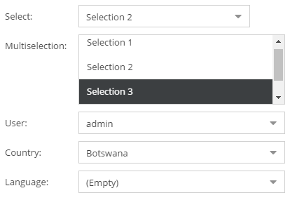
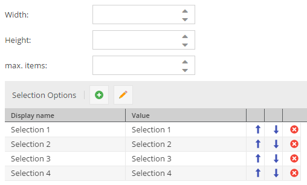

# Select Datatypes

There are 7 different select widgets available. Except the Multiselect widgets, all of them are portrayed by an input 
field with a drop-down list of options. The database column type is VARCHAR for all select data types, TEXT for all 
multiselection types. The configured value (not the display value!) is stored in the database. In the case of 
multiselect, values are stored as a comma separated list. 



For select and multiselect the options can be defined with a value and display value in the class definition: 



Country and language have fixed option values. For the language field the options can be limited to available system 
languages. The country and language select field are also available as multi select fields.
The user field has fixed values as well. It allows to select a user from all available Pimcore system users. 
Thereby a system user can be associated an object. 


### Working with select data types via API

In order to set a select field's value programmatically, the value is simply passed to the setter. To set the values 
of a multiselect field, an array of values is passed to the setter.

```php
$object->setSelect("1");
$object->setMultiselect(["1","2"]);
$object->setLanguage("en");
$object->setCountry("AU");
$object->setUser(1);
$object->save();
```

If one needs to find out what options are available for a select field. This can be done by getting the field definition 
as follows:

```php
$fd = $object->getClass()->getFieldDefinition("multiselect");
$options = $fd->getOptions();
```

If one needs to find out what options are available for a select field inside an ObjectBrick. This can also be done by 
getting the field definition of the brick as follows:

```php
$fd = $brick->getDefinition()->getFieldDefinition("multiselect");
$options = $fd->getOptions();
```


The display name values can be obtained as follows:

```php
$o = Object::getById(49);
$values = Object\Service::getOptionsForMultiSelectField($o, "multiselect"); // for a multiselect data field
$values1 = Object\Service::getOptionsForSelectField($o, "select"); // for a select data field
```
