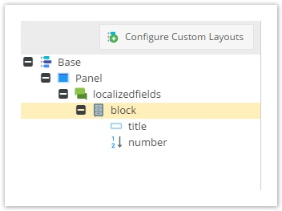

# Blocks

The block data type acts as a simple container for other data fields. 
Similar to a field collection, an unlimited number of block elements can be created.

A block element can be placed into a localized field but can also contain a localized field itself. 
Nesting is not possible.




> The block data basically just gets serialized into a single database column. 
> As a consequence, this container type is not suitable, if you are planning to query the data.

### API Usage

Let us consider the following class definition


and object data
 
 

The value of the second input field can be retrieved as follows:

```php
        $object = Object\BlockClass::getById(48);
        /** @var  $blockData Object\ClassDefinition\Data\Block */
        $blockItems = $object->getBlockElement1();
        /** @var  $firstBlockItem Object\Data\BlockElement */
        $firstBlockItem = $blockItems[0];
        echo($firstBlockItem["input2"]->getData());
```

The output will be "value2".

The value can be updated in a similar way.

```php
        // ... same as above ...
        $firstBlockItem["input2"]->setData(time());
        $object->save();
```

Create a Block:

```php
/** 
 * @var  $blockElement Object\Data\BlockElement
 * 
 * BlockElement( name, type, data )
 */
$blockElement = new BlockElement( 'date', 'date', Carbon::now() );


