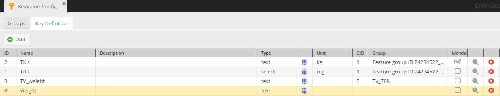
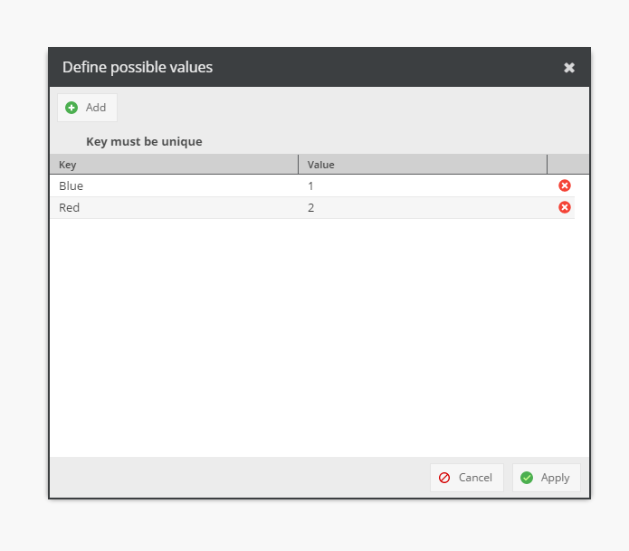

# Key Vaile Pairs

## Overview

The Key Value data type allows to add an arbitrary number of key/value pairs to objects with the restriction that each 
key can only be added once to that object.

Keys are defined and managed in a global list and can be organized into groups (optional).

## Configuration of Keys

Open the **key/group** definition tab via the `Settings` -> `Object` -> `KeyValue Config` config menu.

### Adding a group

Groups are used to group keys together, for example describing certain aspects of a feature set.

Add a group by clicking on the `Add` button. A description can be entered directly in the description grid column.


### Adding a key

Switch to the `Key definition` tab. You will see a list of all defined keys:

* `ID`: the internal database id
* `Name`: The name of the key
* `Description`: A user-friendly description of the key (optional but recommended)
* `Type`: The datatype of the value, can be either "text”, "number”, "bool” or "select”
* `Detailed Configuration action column`: Currently used for "select” datatype allowing you to enter possible options. See below.
* `Unit`: Additional optional field which can be used to enter a dimension unit for example.
* `GID`: the group id if associated with a group
* `Group`: the group description (as entered in the group configuration) if associated with a group
* `Search action column`:  Opens the group selection dialog
* `Remove action column`: Removes the key from the global list.



A key can be added by clicking on the `Add` button. Note that the key name must be unique. 
Double-click on description, type or unit cell if you want to add a description, change the data type or specify 
the dimension unit, respectively.

For the `select` data type you also have to provide a list of options. Click on the `Detailed Configuration` 
button which will open the options editor.



* `Key` represents name for display.
* `Value` is for internal representation.


Click on the `Magnifier` button if you want the key to be part of a group.


Either double-click on a group or select a group and confirm using the `Apply` button. An assignment can be 
reverted by opening the group selection dialog again and closing it using the `Apply` button without a selection.


## Adding a KeyValue field to class definition

**Note:** there can be only one KeyValue field per object. The field’s name is predefined and cannot be changed.


After it, you can see few special settings which are primarily used for the grid editor.

* `Key column width`: The width of the "key name/key description” column.
* `Group column width`: The width of the "group/group description” column.
* `Value column width`: The width of the "value” column.
* `Max Height`: The maximum height of the grid.


## Adding KeyValue pairs to the object

Click on the plus sign to add one or more key/value pairs to your object. This will open the group/key selection dialog. 
Pick one or more keys which should be added to your object. Selecting a group will add all keys within that group. 

Double click inside the `value` column to enter a value. The actual behavior depends on the data type declared 
in the key configuration.


## Working with PHP api
The key definition consists at least of a key name and its type.

```php
$keyconfig = new Object\KeyValue\KeyConfig();            
$keyconfig ->setName("keyname");
$keyconfig ->setType("text");
$keyconfig ->save();
```

Supported types are:
* text
* number
* bool (yes or no)
* select

For `select`, you have to specify a list of possible values which is expected as a json-encoded list of possible options.
An option consists of text presented to the user and the internal value used for storing the actual choice.

```php
$options = [
    ["key" => "option1", "value" => "1"],
    ["key" => "option2", "value" => "2"]
];
 
$keyconfig ->setPossibleValues(json_encode($options));
$keyconfig ->save();
$keyid = $keyconfig->getId();
```

Setting other values:

```php
$keyconfig ->setDescription("very nice description") // description
$keyconfig->setGroup(9);                            // expecting the group’s id
```

Creating a new group:
```php
$groupConfig = new Object\KeyValue\GroupConfig();
$groupConfig->setDescription("nice description");
$groupConfig->setName("groupname");
$groupConfig->save();
$groupId = $groupConfig->getId();                // use this id to associate a key with a group
```

The following example shows how to add two keyvalue pairs to an object assuming that the key id is already known. 
The key id can be retrieved from `Pimcore\Model\Object\KeyValue\KeyConfig` by calling `getId()`;

```php
$keyconfig1 = Object\KeyValue\KeyConfig::getByName("keyconfig”);     // look up the key config by name and retrieve the id
$keyid1 = $keyconfig->getId();
 
$keyconfig2 = ...
$keyid2 = …
 
//The key value data field expects a list of key id / value pairs, so ...
$pairs = [];
$pair1 = [];
$pair1["key"] = $keyid1;
$pair1["value"] = "some value”;
$pairs[] = $pair1;
$pair2 = [];
...
...
$pairs[] = $pair2;
// now create a new KeyValue object, set the object id and pass in the key/value pairs.
 
$keyValueData = new Object\Data\KeyValue();
$keyValueData->setObjectId($obj->getId());
$keyValueData->setProperties($pairs);
$obj->setKeyvaluepairs($keyValueData);
 
// Finally, save your object
$obj->save();
 
 
 
// -------------------------------------------------------------------------------------
// Working with existing Key-Value Pairs
// -------------------------------------------------------------------------------------
 
$object = Object\Article::getById(62883);
 
// all following getters return an instance of Object\Data\KeyValue\Entry
 
// magic getter for getting entry by key name
$object->getKeyvaluepairs()->getBAA351005();
 
 
// extended magic getter for getting entry by key name in combination with group name
// useful in case of not unique key names
$object->getKeyvaluepairs()->getWithGroupNameBAA351005("19140601_(ECLASS-6.0)");
 
 
// getting entry by key name
$object->getKeyvaluepairs()->getEntryByKeyId(871);
 
 
// setting single value for a key - all existing values with that key are removed
$object->getKeyvaluepairs()->setValueWithKeyId("1366", "NEW VALUE 2"));
 
 
// setting multivalent value for a key - all existing values with that key are removed
$object->getKeyvaluepairs()->setValueWithKeyId("1366", ["NEW VALUE 2", "NEW VALUE 3"]);
```