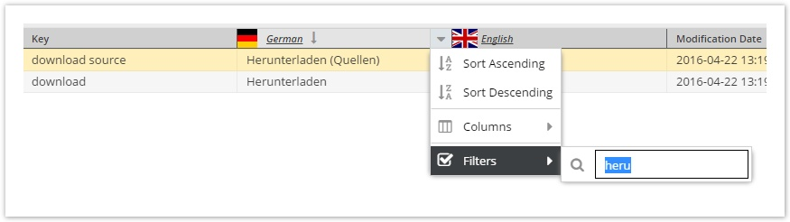

# Shared Translations 

Pimcore provides a simple translation-tool based on `\Zend_Translate` - Shared Translations or formerly Website Translations.

It automatically uses the locale specified on a document. If no locale is present, you can still register a locale manually 
in your code using `\Zend_Registry::set("Zend_Locale", new \Zend_Locale("en"));`

For using the shared translations in frontend, just use the translate helper of `\Zend_View` in your templates with
`<?= $this->translate("translation_key") ?>` or also by using a shorthand `<?= $this->t("translation_key"); ?>`. 


Once a translation-key is requested Pimcore registers the key in the translation administration, and you can edit all 
the translations in a grid in Pimcore backend at `Extras` > `Translation` > `Shared Translations`.


Available languages are defined within the system languages, see [here](./README.md).
 

## Working with shared translations in Code
 
#### Example in Website\Controller\Action

```php
<?php
namespace Website\Controller;
use Pimcore\Controller\Action\Frontend;

class Action extends Frontend {
  
    public function init () {
      
        parent::init();
     
        $locale = new \Zend_Locale('en_US');
        \Zend_Registry::set('Zend_Locale', $locale);
      
    }
    ...
}
  
```

#### Example in Templates / Views

```php
<div>
    <address>&copy; <?= $this->translate("copyright") ?></address>
    <a href="/imprint"><?= $this->translate("imprint") ?></a>
    <a href="/legal"><?= $this->translate("legal_notice") ?></a>
</div>

//shorthands
<div>
    <address>&copy; <?= $this->t("copyright") ?></address>
    <a href="/imprint"><?= $this->t("imprint") ?></a>
    <a href="/legal"><?= $this->t("legal_notice") ?></a>
</div>

```

## Pimcore backend functionalities

### Sorting & Filtering on language level (ExtJS 6 only)




### Translation Export & Import

Translations can be exported to a CSV file and then re-imported later on.


Translations are still imported automatically as long as the translation key does not exist in the target system or the 
translation itself is still empty. Conflicts (i.e. the translation in the target system does not match the version of 
the source) are shown in an overview tab and then can be merged manually.


