# Workflow Management

[TOC]

## General
Workflow Management provides a structured, orchestrated set of steps to maintain and improve data quality held within Pimcore 
elements (assets, documents, objects).

There are several new concepts to know about when using Workflow Management module, each is lightweight and defined within 
a single configuration file, allowing developers to customize Pimcore even further.

### Concepts 

**States**
A high level overview of where information is in the PIM. Create RAG/Traffic light configurations for quickly showing the state of data.
* Great for custom reporting and customising availability of information from different perspectives.

**Statuses**
The position an element is at within a workflow. Statuses help define lifecycle specific user permissions.
* control who can view/edit/process information once a product goes Live or an order is paid for.

**Actions**
Tasks or processes that can be performed on elements. Actions define.
* What happens to information before/after that action happens? i.e. Should the product be synced with a 3rd party system, or an email sent to a customer.
* Who can perform an action – i.e. only the manager’s role can approve a product smt or ship an order.
* Which additional information is necessary to complete the action.

**Transition Definitions**
These hold together States, Status & Actions into a complete workflow configuration.
* An order is *"paid"* therefore it can "shipped" or "refunded".


## Configuration

### The example configuration

In the fresh installation of Pimcore, you can find the example file with configuration in the `website_example/config/workflowmanagement.example.php` directory.
[See that file on GitHub](https://github.com/pimcore/pimcore/blob/master/website_example/config/workflowmanagement.example.php).

### Details

**Workflows array**

You can put many workflows to the `workflows` array.
Look at the base structure for the workflows configuration. 

```php
<?php

return [
    "workflows" => [
        [
            //workflow for products objects
        ],
        [
            //a general workflow for documents, objects and assets
        ]
    ]
];
```

**Available options**

| Configuration Key                                                                         | Type        | Is required?   | Description                                                                                                                                                                                                                                                                                                                                                                                           |
|-------------------------------------------------------------------------------------------|-------------|----------------|-------------------------------------------------------------------------------------------------------------------------------------------------------------------------------------------------------------------------------------------------------------------------------------------------------------------------------------------------------------------------------------------------------|
| `["workflows"][i]["name"]`                                                                | string      | Y              | The display name, is shown at the workflow window in the administration panel.                                                                                                                                                                                                                                                                                                                        |
| `["workflows"][i]["id"]`                                                                  | int         | Y              | Unique ID chosen by you.                                                                                                                                                                                                                                                                                                                                                                              |
| `["workflows"][i]["workflowSubject"]`                                                     | array       | Y              | Defined for which elements the workflow is for                                                                                                                                                                                                                                                                                                                                                        |
| `["workflows"][i]["workflowSubject"]["types"]`                                            | array       | Y              | Array with allowed types of elements using the workflow (asset,object,document).                                                                                                                                                                                                                                                                                                                      |
| `["workflows"][i]["workflowSubject"]["classes"]`                                          | array       | Objects only   | The class id's that this workflow applies to, defaults to NONE                                                                                                                                                                                                                                                                                                                                        |
| `["workflows"][i]["workflowSubject"]["assetTypes"]`                                       | array       | Assets only    | Asset types the workflow is for, defaults to NONE. For example: image, video                                                                                                                                                                                                                                                                                                                          |
| `["workflows"][i]["workflowSubject"]["documentTypes"]`                                    | array       | Documents only | Document types the workflow is for, defaults to NONE. For example: page, snippet                                                                                                                                                                                                                                                                                                                      |
| `["workflows"][i]["enabled"]`                                                             | boolean     | Y              | Flag to enable / disable the workflow.                                                                                                                                                                                                                                                                                                                                                                |
| `["workflows"][i]["defaultState"]`                                                        | string      | Y              | The default state for elements. The state has to be chosen from the `["workflows"][i]["states"]` array.                                                                                                                                                                                                                                                                                               |
| `["workflows"][i]["defaultStatus"]`                                                       | string      | Y              | The default status for elements. The status has to be chosen from the `["workflows"][i]["statuses"]` array.                                                                                                                                                                                                                                                                                           |
| `["workflows"][i]["allowUnpublished"]`                                                    | boolean     | Y              | Set true to allow the workflow on unpublished elements, false to only allow published elements.                                                                                                                                                                                                                                                                                                       |
| `["workflows"][i]["states"]`                                                              | array       | Y              | Array of available states in the workflow.                                                                                                                                                                                                                                                                                                                                                            |
| `["workflows"][i]["states"][j]["name"]`                                                   | string      | Y              | The name of the state (used as a key for example in the code).                                                                                                                                                                                                                                                                                                                                        |
| `["workflows"][i]["states"][j]["label"]`                                                  | string      | Y              | The label of the state - used in the administration panel to show the state of elements.                                                                                                                                                                                                                                                                                                              |
| `["workflows"][i]["states"][j]["color"]`                                                  | string      | N              | UI colour / theme. You can choose the color visible with the label.                                                                                                                                                                                                                                                                                                                                   |
| `["workflows"][i]["statuses"]`                                                            | array       | Y              | Array of available statuses in the workflow.                                                                                                                                                                                                                                                                                                                                                          |
| `["workflows"][i]["statuses"][j]["name"]`                                                 | string      | Y              | The name of the status (used as a key for example in the code).                                                                                                                                                                                                                                                                                                                                       |
| `["workflows"][i]["statuses"][j]["label"]`                                                | string      | Y              | The label of the status - used in the administration panel to show the status of elements.                                                                                                                                                                                                                                                                                                            |
| `["workflows"][i]["statuses"][j]["objectLayout"]`                                         | int         | N              | **It works only with objects.** It's an id of the default custom layout loaded with that workflow status.                                                                                                                                                                                                                                                                                             |
| `["workflows"][i]["statuses"][j]["elementPublished"]`                                     | boolean     | N              | **It works only with objects and page snippets.** The element gets published in this step.                                                                                                                                                                                                                                                                                                            |
| `["workflows"][i]["actions"]`                                                             | array       | Y              | Actions definitions, operations which could be amplify to elements.                                                                                                                                                                                                                                                                                                                                   |
| `["workflows"][i]["actions"][j]["name"]`                                                  | string      | Y              | The name of the action (used as a key).                                                                                                                                                                                                                                                                                                                                                               |
| `["workflows"][i]["actions"][j]["label"]`                                                 | string      | Y              |                                                                                                                                                                                                                                                                                                                                                                                                       |
| `["workflows"][i]["actions"][j]["transitionTo"]`                                          | array       | Y              | Defines which state and status could be set with that action.                                                                                                                                                                                                                                                                                                                                         |
| `["workflows"][i]["actions"][j]["transitionTo"][stateName]`                               | array       | Y              | Every stateName (state) could have connected many statuses. To add the status to array, just use the status name. (See the example, below.)                                                                                                                                                                                                                                                           |
| `["workflows"][i]["actions"][j]["notes"]`                                                 | array       | N              | Notes configuration for the action.                                                                                                                                                                                                                                                                                                                                                                   |
| `["workflows"][i]["actions"][j]["notes"]["required"]`                                     | boolean     | N              | disable / enable notes                                                                                                                                                                                                                                                                                                                                                                                |
| `["workflows"][i]["actions"][j]["notes"]["type"]`                                         | string      | N              | An optional alternative "type" for the note, defaults to "Status update" or "Global action" if blank                                                                                                                                                                                                                                                                                                  |
| `["workflows"][i]["actions"][j]["notes"]["title"]`                                        | string      | N              | An optional alternative "title" for the note, if blank the actions transition result is used (See Decorator).                                                                                                                                                                                                                                                                                         |
| `["workflows"][i]["actions"][j]["users"]`                                                 | array       | N              | User ids able to use that action. Admin is always allowed for every action.                                                                                                                                                                                                                                                                                                                            |
| `["workflows"][i]["actions"][j]["events"]`                                                | array       | N              | Classes which would be called by special triggers available in the workflow module.                                                                                                                                                                                                                                                                                                                   |
| `["workflows"][i]["actions"][j]["events"]["before"]`                                      | array       | N              | For example: `['\\Website\\WorkflowExampleEventHandler', 'before']`. The method `before` from the `'\\Website\\WorkflowExampleEventHandler'`class will be called when the `before` event is triggered.                                                                                                                                                                                                |
| `["workflows"][i]["actions"][j]["events"]["success"]`                                     | array       | N              | For example: `['\\Website\\WorkflowExampleEventHandler', 'success']`. The method `success` from the `'\\Website\\WorkflowExampleEventHandler'`class will be called when the `success` event is triggered.                                                                                                                                                                                             |
| `["workflows"][i]["actions"][j]["events"]["failure"]`                                     | array       | N              | For example: `['\\Website\\WorkflowExampleEventHandler', 'failure']`. The method `failure` from the `'\\Website\\WorkflowExampleEventHandler'`class will be called when the `failure` event is triggered.                                                                                                                                                                                             |
| `["workflows"][i]["actions"][j]["notificationUsers"]`                                     | array       | N              | Array with user ID's. Users who are in that range are notificated when the action is triggered.                                                                                                                                                                                                                                                                                                       |
| `["workflows"][i]["actions"][j]["additionalFields"]`                                      | array       | N              | Additional fields used in the action.                                                                                                                                                                                                                                                                                                                                                                 |
| `["workflows"][i]["actions"][j]["additionalFields"][k]["name"]`                           | string      | Y              | The name used in the form.                                                                                                                                                                                                                                                                                                                                                                            |
| `["workflows"][i]["actions"][j]["additionalFields"][k]["fieldType"]`                      | string      | Y              | The data component name (for example: input, textarea). See the list of [available data types](../05_Objects/01_Object_Classes/01_Data_Types/_index.md).                                                                                                                                                                                                                                              |
| `["workflows"][i]["actions"][j]["additionalFields"][k]["title"]`                          | string      | Y              | The label used by the field.                                                                                                                                                                                                                                                                                                                                                                          |
| `["workflows"][i]["actions"][j]["additionalFields"][k]["blankText"]`                      | string      | N              | The blank text used in the form component (For example it would be: *test@example.com* in the email field).                                                                                                                                                                                                                                                                                           |
| `["workflows"][i]["actions"][j]["additionalFields"][k]["required"]`                       | boolean     | Y              | Whether or not the field is required.                                                                                                                                                                                                                                                                                                                                                                 |
| `["workflows"][i]["actions"][j]["additionalFields"][k]["setternFn"]`                      | string,null | N              | Optional setter function (available in the element, for example in the updated object), if not specified, data will be added to notes. The Workflow manager will call the function with the whole field data. (See [the code line on Github](https://github.com/pimcore/pimcore/blob/23a6d764227a529fae637fa0a5a548bc302ccd46/pimcore/lib/Pimcore/WorkflowManagement/Workflow/Manager.php#L527-L527)) |
| `["workflows"][i]["transitionDefinitions"]`                                               | array       | Y              | These definitions specify the true workflow, are like the sequence for actions.                                                                                                                                                                                                                                                                                                                       |
| `["workflows"][i]["transitionDefinitions"][transitionName]["validActions"]`               | array       | Y              | Specify actions valid during the specific step. A `transitionName` is the unique name of the transition. For example: todo, reopened, in_progress                                                                                                                                                                                                                                                     |
| `["workflows"][i]["transitionDefinitions"][transitionName]["validActions"][actionName]`   | null        | Y              | Specify valid action names (`actionName` as a key, null as a value).                                                                                                                                                                                                                                                                                                                                  |
| `["workflows"][i]["transitionDefinitions"]["globalActions"]`                              | array       | N              | Actions available in every step of the workflow.                                                                                                                                                                                                                                                                                                                                                      |
| `["workflows"][i]["transitionDefinitions"]["globalActions"][actionName]`                  | array       | N              | Specify valid action names (`actionName` as a key, null as a value).                                                                                                                                                                                                                                                                                                                                  |

## Usage examples

Let's make a one truly simple example workflow for product objects. 

### Create a class and custom layouts

I've created the really simple product class. (sku, localized name, localized picture and localized description, price and quantity).
The class has ID = 13.

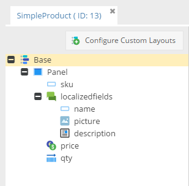

Next, I added four custom layouts which later I will assign to the specific statuses.

* `new_product` layout with ID = 1

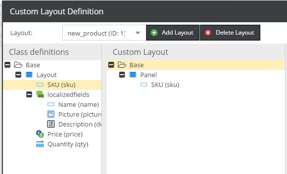

* `fill_contents` layout with ID = 2 

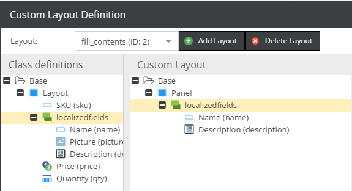

* `update_picture` layout with ID = 3

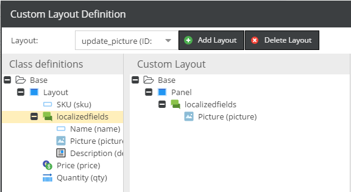

* `validate_qty_price` layout with ID = 4


### The workflow declaration

Now create the base configuration file: `website/config/workflowmanagement.php`

```php
<?php
return [
  "workflows" => [
        [
            "name" => "Product workflow",
            "id" => 1,
            "workflowSubject" => [
              "types" => ["object"],
              "classes" => [13],
            ],
            "enabled" => true,
            "defaultState" => "", //@TODO
            "defaultStatus" => "", //@TODO
            "allowUnpublished" => true,
            "states" => [
              //@TODO
            ],
            "statuses" => [
              //@TODO
            ],
            "actions" => [
              //@TODO
            ],
            "transitionDefinitions" => [
              //@TODO
            ]
        ]
  ]
];
```

As you can see, the workflow is called **Product workflow**, we haven't added any statuses, states, actions and definitions. 
The workflow is available only for instances of class with id 13 (the `SimpleProduct` class in that case).

### Specify states

Now it's the best time to define some states for products. 
What I want to achieve? Let's suppose that our new products are integrated with an external system and new positions comes to Pimcore as empty objects only with SKU.
I need to have ability to decide which products would be used in Pimcore, the rest of products I want to reject.
To achieve that requirement, I have to make two states.

* Opened - for new products. Opened in my case would mean only *"new product"*
* Processing - for unfinished products
* Done - for published and rejected products. There doesn't exist any required action for that product. 

```php
...

"states" => [
    [
      "name" => "opened",
      "label" => "Unfinished product",
      "color" => "#377ea9"
    ],
    [
      "name" => "processing",
      "label" => "Processing",
      "color" => "#d9ef36"
    ],
    [
      "name" => "done",
      "label" => "Finished product",
      "color" => "#28a013"
    ]
],

...
```

### Specify the first statuses and actions

As an administrator, I can decide which product can be processed and which shouldn't be.

I need three statuses:

* new - for the newest products
* rejected - for products which I'm not going to use in the future. Also I would like to add some note with a reason here.
* update contents - for products I would like to publish


```php
...

"statuses" => [
    [
      "name" => "new",
      "label" => "New product",
      "objectLayout" => 1
    ],
    [
      "name" => "rejected",
      "label" => "Rejected product"
    ],
    [
      "name" => "update_contents",
      "label" => "Updating contents step",
    ]
],

...
```
As you can see I used `objectLayout` key to define which custom layout would be used with the *new* status.

I should also add some actions.

* reject product - to change the status for products I don't want to use
* start processing - to move the product to the processing step

```php
...

"actions" => [
    [
      "name" => "reject",
      "label" => "Reject the product",
      "transitionTo" => [
          "done" => [
              "rejected"
          ]
      ],
      "notes" => [
          "required" => false
      ]
    ],
    [
      "name" => "process",
      "label" => "Start processing the product",
      "transitionTo" => [
          "processing" => [
              "update_contents"
          ]
      ]
    ]
],

...
```

Example above shows that every action has related only one state and status, you can of course in the array specify as many statuses and states as you need.
 
### More statuses actions and definitions

The process state has 4 stages: 

* updating the content (we've already prepared statuses and the action for that)
* updating the picture
* updating the price and stock
* mark contents as a ready - move product back to the administrator

Let's add few new rows in the configuration file

```php

...
"statuses" => [
...
    [
      "name" => "update_picture",
      "label" => "Update the product picture",
      "objectLayout" => 3
    ],
    [
      "name" => "validate_stock_and_price",
      "label" => "Check the quantity and the price",
      "objectLayout" => 4
    ],
    [
      "name" => "contents_preapared",
      "label" => "Contents ready to publish"
    ]
],
...

"actions" => [
...

    [
      "name" => "contents_updated",
      "label" => "Contents up-to-date",
      "transitionTo" => [
          "processing" => [
              "update_picture"
          ]
      ]
    ],
    [
      "name" => "picture_updated",
      "label" => "Picture up-to-date",
      "transitionTo" => [
          "processing" => [
              "validate_stock_and_price"
          ]
      ]
    ],
    [
      "name" => "contents_ready",
      "label" => "Contents are ready to publish",
      "transitionTo" => [
          "processing" => ["contents_preapared"]
      ],
      "notes" => [
          "required" => false
      ]
    ]
],

...

```

### Last actions: publish or rollback

At the final stage of the workflow I would like to have three choices

* Publish the product (with additional field called *"timeWorked"*)
* Start workflow from the beginning
* Reject the product (with note)

We've already made the reject and start processing action, the last one we need is publishing (the new status and action).

Let's add the new status which requires publishing privileges from the user.

```php
[
    "name" => "accepted",
    "label" => "Accepted product",
    "elementPublished" => true
]
```

And, the action with the *"timeWorked"* field.

```php
[
    "name" => "publish",
    "label" => "Publish the product",
    "transitionTo" => [
          "done" => [
             "accepted"
          ]
    ],
    "additionalFields" => [
        [
            "name"=> "timeWorked",
            "fieldType"=> "input",
            "title"=> "Time spent",
            "blankText"=> "30m",
            "required"=> true,
            "setterFn"=> null
        ]
    ]
]
```

### Transition definitions

The last thing you have to do before start using the workflow - transition definitions.
These definitions specify which actions are available at a specific stage.

```php
...
"transitionDefinitions" => [
  "new" => [ //this is the starting status, at the moment we can only set the product as rejected or move it to the processing stage
      "validActions" => [
          "reject" => null,
          "process" => null
      ]
  ],
  "rejected" => [ //we can only mark rejected project as a new
      "validActions" => [
          "new" => null
      ]
  ],
  "update_contents" => [ // the product with update_contents status is able to use the contents_updated action
      "validActions" => [
          "contents_updated" => null
      ]
  ],
  "update_picture" => [ // the product with update_picture status is able to use the picture_updated action
      "validActions" => [
          "picture_updated" => null
      ]
  ],
  "validate_stock_and_price" => [ //here we can mark cthe product as a ready to the final validation
      "validActions" => [
          "contents_ready" => null
      ]
  ],
  "contents_preapared" => [ // accept, reject or rollback
      "validActions" => [
          "process" => null,
          "reject" => null,
          "publish" => null
      ]
  ],
  "accepted" => [
      "validActions" => [
          "reject" => null
      ]
  ]
]
...
```

Let's define the default status and state.

```php
...
"defaultState" => "opened",
"defaultStatus" => "new",
...
```

### Workflow in action

Below, you can find showcase of the workflow I've just prepared.

| Status                                                                      | Layout                                                                      | Action                                                                       |
|-----------------------------------------------------------------------------|-----------------------------------------------------------------------------|------------------------------------------------------------------------------|
| 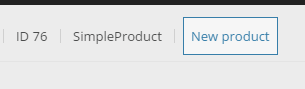       | 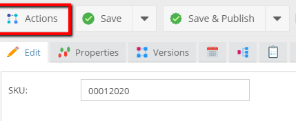       |        |
|    |    | 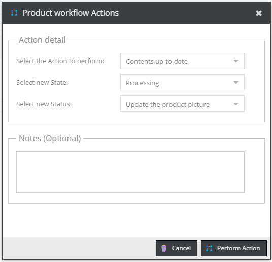   |
| 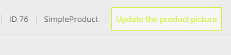    | 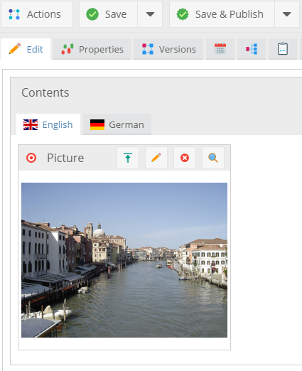    | 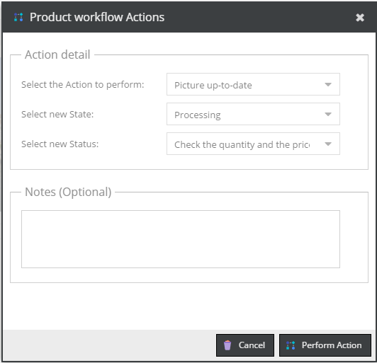    |
|       |       |       |
|             |             | 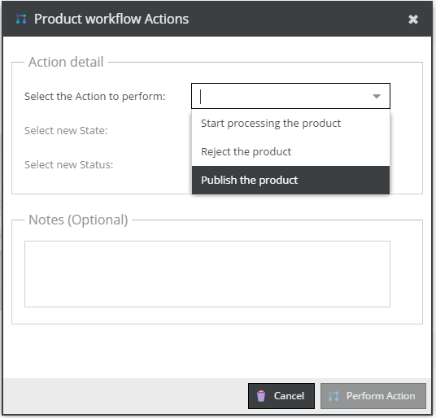           |
|             |             | 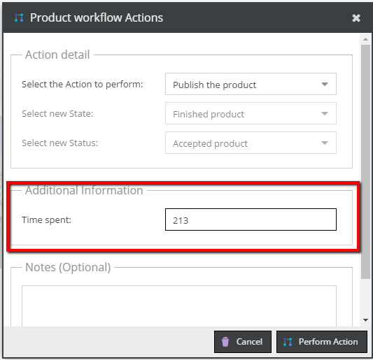           |
|         |             | 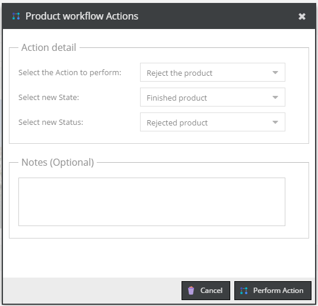        |

### Check the history

In the *"Notes & Events"* tab, there is a list with every action used on the object via the Workflow module.

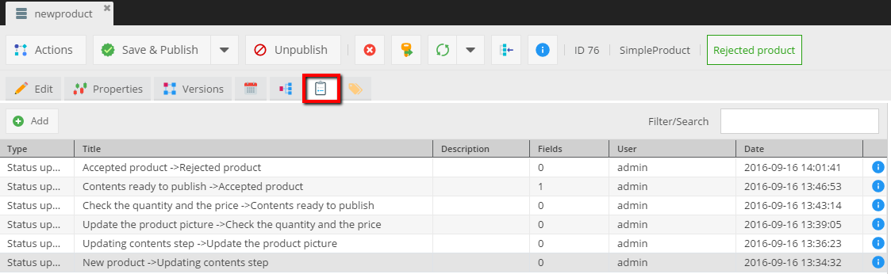