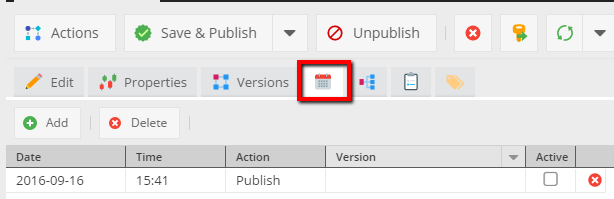
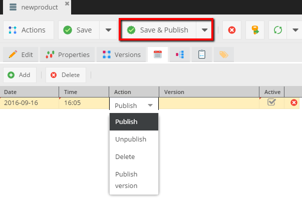
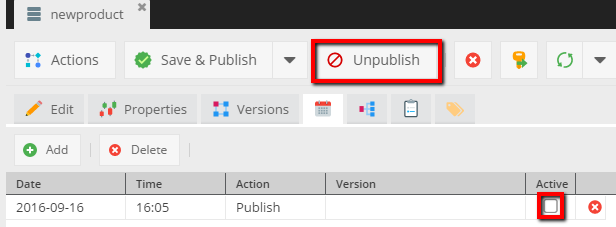

# Scheduling

## General
Every element type in Pimcore (documents, objects, assets) has implemented a scheduler which provides the ability to create 
tasks like:

* Publish
* Unpublish
* Delete
* Publish version (You can read more about Versions in [the Versioning section](./01_Versioning.md))

**Note:** To use scheduler you have to configure "cronjobs". You can find more in the [System setup section](../13_Installation_and_Upgrade/03_System_Setup_and_Hosting/README.md).


## Usage

Let's get objects as an example.
In the Pimcore backend UI find the icon: 



You can add the task by clicking on the **Add** button, then an empty row shows. 
There is few configurable options: date, time and action which should run with that task. 
The *"active"* checkbox is unchecked after the task finished.
The Version option would be used only if you chosen the "Publish version"* action.

To make the task which automatically publish an unpublished object just fill values like in the picture, below.



And the effect in the database:

```
`schedule_tasks`
# id, cid, ctype, date, action, version, active
'7', '76', 'object', '1474034700', 'publish', NULL, '1'
```

When the `pimcore/cli/maintenance.php` script will finish processing jobs you could see the changes.

In the edit object view:



In the database:
```
`schedule_tasks`
# id, cid, ctype, date, action, version, active
'8', '76', 'object', '1474034700', 'publish', NULL, '0'
```
 

