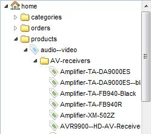

# Custom icons and style in object-tree

## General 

It is possible to define custom icons and styles for objects in the object tree. 
In order to do so, overwrite the method `getElementAdminStyle` of `Object_Abstract` by using the class mapping functionality 
([Extending pimcore](../10_Extending_Pimcore/13_Plugin_Developers_Guide/_index.md)) and return your own implementation 
of `Element_AdminStyle`.

## Possible properties to define

* Element css class
* Element icon
* Element icon class

## Extend the object class and overwrite the `getElementAdminStyle`

```php
public function getElementAdminStyle() {
    if (!$this->o_elementAdminStyle) {
        $this->o_elementAdminStyle = new Website_OnlineShop_AdminStyle($this);
    }
    return $this->o_elementAdminStyle;
}
```

## Custom Implementation of `Element_AdminStyle`

```php
class Website_OnlineShop_AdminStyle extends Element_AdminStyle 
{ 
    public function __construct($element) {
        parent::__construct($element);
 
        if($element instanceof Website_OnlineShop_Product) {
            if($element->getProductType() == "concrete") {
                $this->elementIcon = '/pimcore/static/img/icon/tag_green.png';
                $this->elementIconClass = null;
            } else if($element->getProductType() == "family") {
                $this->elementIcon = '/pimcore/static/img/icon/tag_yellow.png';
                $this->elementIconClass = null;
            } else if($element->getProductType() == "virtual") {
                $this->elementIcon = '/pimcore/static/img/icon/tag_blue.png';
                $this->elementIconClass = null;
            }
 
        }
    }
 
}
```

**Result**:



## Custom tooltips

Since build 3584 it is possible to define custom tooltips which are shown while hovering over the object tree.


The procedure is the same as for the icons. 

**Code sample**:

```php
public function getElementQtipConfig() {
    if ($this->element instanceof \Pimcore\Model\Object\News) {
        $thumbnail = $this->element->getImage_1()->getThumbnail("exampleResize");
        return [
            "title" => "ID: " . $this->element->getId() . " - " . $this->element->getDate(),
            "text" => '<h1>' . $this->element->getTitle() . '</h1>'
                . '<p></p> ' . $this->element->getShortText()
        ];
    }
    return parent::getElementQtipConfig();
}
```

