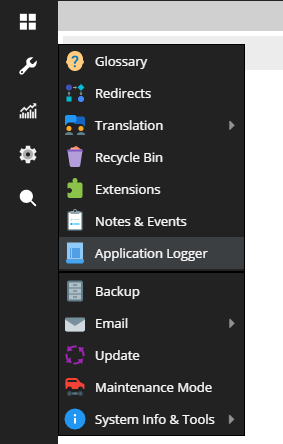
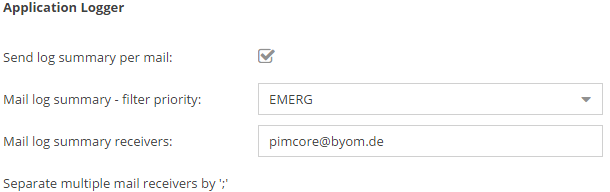

# Application logger

## General

The application logger is a tool, which developers can use to log 
certain events and errors within a Pimcore powered application. 

<div class="inline-imgs">

The logs are visible and searchable within the Pimcore backend GUI  **Tools -> Application Logger**:

</div>




## How to create log entries

The application logger is a PSR-3 compatible component and available on the service container (`pimcore.app_logger`)
and therefore it can be used the usual way:

### Basic Usage - Example

#### Controller / Action
```php
$this->get("pimcore.app_logger")->error("Your error message");
$this->get("pimcore.app_logger")->alert("Your alert");
$this->get("pimcore.app_logger")->debug("Your alert", ["foo" => "bar"); // additional context information
```

#### Dependency Injection / Container
```php
app.your_service:
  class: AppBundle\Service\YourService
  calls:
    - [setLogger, ['pimcore.app_logger']]
```

### Advanced Usage - Example

There are some context variables with a special functionality: fileObject, relatedObject, component.

```php
$logger = \Pimcore::getContainer()->get("pimcore.app_logger"); 
 
$fileObject = new \Pimcore\Log\FileObject("some interesting data");
$myObject = \Pimcore\Model\Object\AbstractObject::getById(73);
 
$logger->error("my error message", [
    "fileObject" => $fileObject,
    "relatedObject" => $myObject, 
    "component" => "different component"
]);
```

In the application logger grid, the new row was created: *my error message* with related object. 

If you click on the row you can go to the object editor by clicking on the *Related object* edit icon in the popup.


### Setting an individual logger level

Adds a console logger and sets the minimum logging level to *INFO* (overwrites log level in Pimcore system settings):

```php
$logger = \Pimcore\Log\ApplicationLogger::getInstance("SAP_exporter", true); 
// returns a PSR-3 compatible logger, registers a custom app logger as `pimcore.app_logger.SAP_exporter` on the service container
$logger->addWriter(new \Monolog\Handler\StreamHandler('php://output', \Monolog\Logger::INFO));
```

## Configuration

There are some options in the system settings to configure the application logger (within the *Debug* panel):



When the *Send log summary per mail* checkbox is activated the defined receivers will receive log entries by mail. 
The priority can be used to setup which log messages will be contained in the mail. 
For example errors are more important than just info entries. 

The archive function automatically creates new database tables to archive the log entries in the form `application_logs_archive_*`. 
In the above example log entries will be moved after 30 days to these archive tables. 
Optionally a different database name for the archive tables can be defined. 

