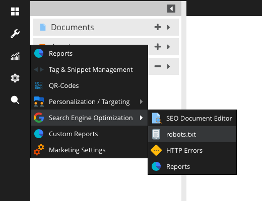

# Robots.txt

Robots.txt files can be generated on a per-site basis.




By default, if a Robots.txt file is not configured for a given site, the following is generated upon robots.txt being requested:

```
User-agent: *
Disallow:
```

Alternatively, you can manually create robots.txt files. The default location for robots.txt files is website/var/config.

The filename for robots.txt files is robots-X.txt where X is the site ID for the given robots.txt file.

See [CommonFilesFilter.php](https://github.com/pimcore/pimcore/blob/pimcore4/pimcore/lib/Pimcore/Controller/Plugin/CommonFilesFilter.php) and [SettingsController.php](https://github.com/pimcore/pimcore/blob/pimcore4/pimcore/modules/admin/controllers/SettingsController.php) for more information.
