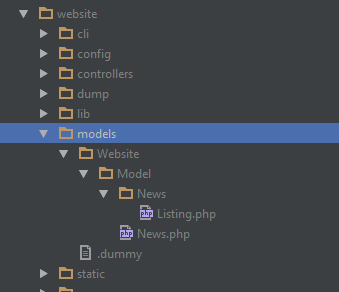

# Dependency Injection

Depencendy Injection is a way for extending and overwriting internal Pimcore classes with custom implementations. 
This is especially useful if you'd like to overwrite models of Pimcore, for details see later in this chapter. 

Internally Pimcore uses [PHP-DI](http://php-di.org/). You can create you own [PHP-DI](http://php-di.org/) configuration 
which extends or overwrites the core configuration.
 
## Creating your Custom Dependency Injection Configuration
Pimcore automatically looks for a configuration in `/website/config/di.php` (there's an example file provided which you 
can rename/reuse). 

This configuration is a normal [PHP-DI configuration](http://php-di.org/doc/php-definitions.html), you can use every 
feature from PHP-DI you like. Additionally you have also access to the container directly in 
`/website/config/startup.php` ([example](https://github.com/pimcore/pimcore/blob/master/website_demo/config/startup.example.php#L45-L45)).
 
## Example Configuration

```php
<?php
return [
    // overwriting Pimcore core models
    'Pimcore\Model\Object\News' => DI\object('Website\Model\News'),
    'Pimcore\Model\Asset\Image' => DI\object('Website\Model\Asset\Image'),
    'Pimcore\Model\Document\Page' => DI\object('Website\Model\Document\Page'),
     
    // values
    'report.recipients' => [
        'bob@example.com',
        'alice@example.com',
    ],
     
    // a factory
    Foo::class => DI\factory([new FooFactory, 'create']),
     
    // objects
    'What\Ever' => DI\object('MyImpl'),
     
    // ...
    // ...
];
```

[Click here for a more advanced example](https://github.com/pimcore/pimcore/blob/master/website_example/config/di.example.php)

## Overwrite Pimcore Models using Dependency Injection
It's possible to map a custom class to a Pimcore model. That means that you can use your own classes inside Pimcore, 
but an example will be more explanatory: 

```php
// define a custom class,  for example:
namespace Website\Model; 
use Pimcore\Model\Object;
  
class News extends Object\News{
 
    public function myCustomGetter () {
        return true;
    }
}
 
// and optionally a related list
namespace Website\Model\News; 
 
class Listing extends \Pimcore\Model\Object\News\Listing {
 
    public function myCustomGetter () {
        return true;
    }
}
```



Now we create a custom configuration for the dependency injection container by modifying `/website/config/di.php` as follows.
 
```php
<?php
return [
    'Pimcore\Model\Object\News' => DI\object('Website\Model\News'),
    'Pimcore\Model\Object\News\Listing' => DI\object('Website\Model\News\Listing'),
];
```

#### Where to put the Files
Because they are models the recommended place for class-mappings is the folder `/website/models/`. Because we are using 
the namespace `Website` in this example the file should be placed at `/website/models/Website/Model/News.php`. 

Instead of the `Website` namespace you can use any other namespace that is registered, but we recommend to use Website, 
since this one is already registered and works out of the box. 

After registering the namespace have to make sure the right class is loaded, either by including it manually or placing
 it somewhere in the include path.


##### Register a new namespace (only when not using Website\ namespace)

To add your own namespace use the `psr-4` or `psr-0` configuration in your `composer.json`:

#### Using the Class Mapping
After that, wherever you retrieve an `Object\News` you will get an `Website\Model\News`, also the following 
`Website\Model\News\Listing` will contain `Website\Model\News`. 

```php
use Pimcore\Model\Object;
  
$myProduct = Object::getById(234);
$myProductList = Object\News::getList(["limit" => 10]);
 
if ($myProduct instanceof \Website\Model\News) {
   // yes that will be true ;-)
}
 
if ($myProductList instanceof \Website\Model\News\Listing) {
   // yes that will be also true ;-)
}
```

> **WARNING**  
> Be carefully if you want to overwrite methods like `save()`, `update()`, `delete()` or any other method which is already defined by Pimcore.


So far it's only read-only that means that the mapping only take effect by the getters like Document::getById() or 
Asset::getList(), .. and so on.

**Don't forget to clear the cache after you change the configuration.**


## Supported Types

Until now this feature is only provided by classes based on `Element\ElementInterface` like `Asset`, `Document`, `Object` 
and their list implementations.
 
The following link provides a more detailed example: 
[https://github.com/pimcore/pimcore/blob/master/website_demo/config/di.example.php](https://github.com/pimcore/pimcore/blob/master/website_demo/config/di.example.php) 

